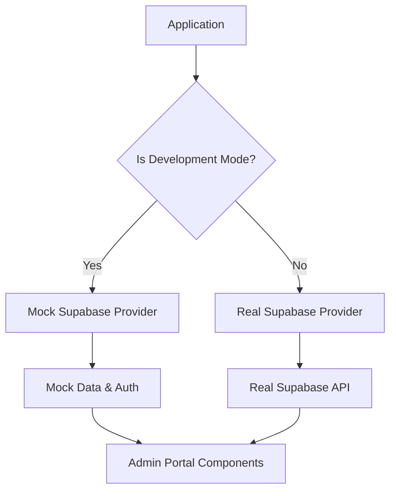

# Plan to Bypass Authentication and API Calls While Preserving Admin Functionality

## Problem Analysis

The current issue is that the admin portal is hitting Supabase API rate limits, even with our previous attempts to bypass authentication. This is likely because:

1. Authentication checks are still happening in multiple places
2. Data fetching from Supabase is occurring in various components
3. Client-side components may be making their own API calls

## Solution Approach

We'll create a comprehensive solution that preserves the functionality of the admin portal while completely eliminating Supabase API calls in development mode.

### 1. Create a Supabase Mock Provider

### 2. Implementation Plan

1. **Create a Supabase Mock Provider**
   - Create a wrapper around the Supabase client that returns mock data in development mode
   - Implement mock versions of all needed Supabase methods (auth, data fetching, etc.)

2. **Modify Admin Layout**
   - Update to use the mock provider in development mode
   - Ensure no authentication checks are performed in development mode

3. **Update Key Admin Pages**
   - Modify applications, retreat dates, intake, reports, documents, and email pages to use the mock provider
   - Ensure they can function with mock data

4. **Create Development Entry Point**
   - Add a direct link from the homepage to access the admin portal with the mock provider

## Detailed Implementation Steps

### Step 1: Create Mock Supabase Provider

We'll create a mock implementation of the Supabase client that returns predefined data instead of making API calls.

1. Create a new file `src/lib/mock-supabase.ts` that exports a mock Supabase client
2. Implement mock versions of:
   - `auth.getUser()` - Return a mock admin user
   - `auth.getSession()` - Return a mock session
   - `auth.signOut()` - No-op function that resolves successfully
   - `from('applications').select()` - Return mock application data
   - `from('retreat_dates').select()` - Return mock retreat date data
   - `from('participants').select()` - Return mock participant data
   - `from('admins').select()` - Return mock admin data
   - `from('reports').select()` - Return mock report data
   - `from('documents').select()` - Return mock document data
   - `from('email_templates').select()` - Return mock email template data

### Step 2: Create Mock Data for Key Features

We'll create realistic mock data for:
- Applications (status, couple names, dates, etc.)
- Retreat dates (upcoming retreats, capacity, etc.)
- Participant profiles (contact info, status, etc.)
- Admin user information (email, role, etc.)
- Reports (attendance, demographics, etc.)
- Documents (templates, resources, etc.)
- Email templates (welcome emails, reminders, etc.)

This data will be stored in the mock provider and returned when the corresponding methods are called.

### Step 3: Modify Admin Layout and Navigation

1. Update `src/app/(protected)/admin/layout.tsx` to:
   - Skip all authentication checks in development mode
   - Use the mock Supabase client in development mode

2. Update `src/components/admin/top-navigation.tsx` to:
   - Use the mock Supabase client in development mode
   - Skip authentication checks in development mode

### Step 4: Update Admin Pages

1. Modify `src/app/admin/applications/page.tsx` to use the mock Supabase client in development mode
2. Modify `src/app/admin/retreat-dates/page.tsx` to use the mock Supabase client in development mode
3. Modify `src/app/admin/intake/page.tsx` to use the mock Supabase client in development mode
4. Modify `src/app/admin/reports/page.tsx` to use the mock Supabase client in development mode
5. Modify `src/app/admin/documents/page.tsx` to use the mock Supabase client in development mode
6. Modify `src/app/admin/email/page.tsx` to use the mock Supabase client in development mode

### Step 5: Create Development Entry Point

1. Add a direct link from the homepage to the admin portal with the mock provider enabled
2. Create a development-only indicator that shows when the mock provider is active

## Benefits of This Approach

1. Preserves all existing admin portal functionality
2. Completely eliminates Supabase API calls in development mode
3. Allows for testing and development without hitting rate limits
4. Minimal changes to existing code structure

## Implementation Timeline

1. Create mock Supabase provider (1-2 hours)
2. Create mock data for key features (2-3 hours)
3. Modify admin layout and navigation (1 hour)
4. Update admin pages (3-4 hours)
5. Create development entry point (30 minutes)

Total estimated time: 7.5-10.5 hours