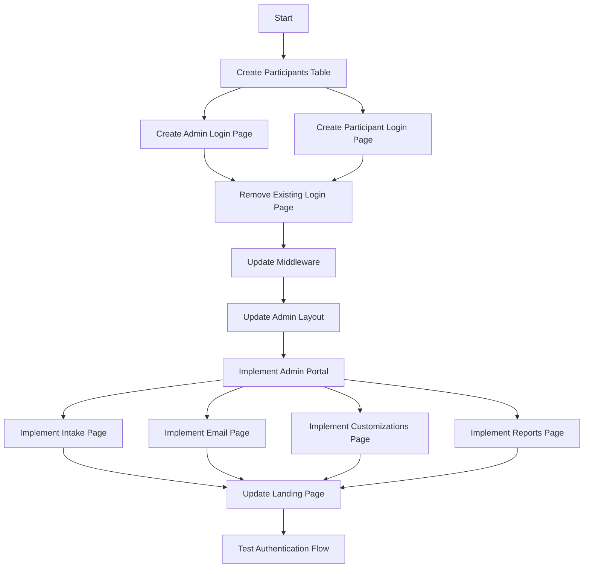
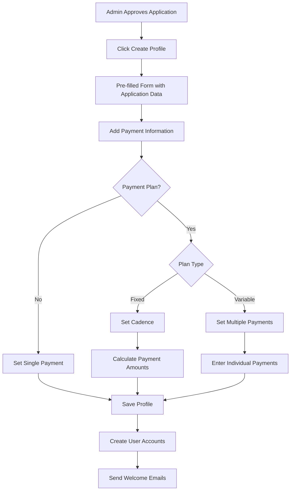

# Authentication Redesign Implementation Plan

This document outlines the detailed implementation plan for redesigning the authentication system with separate routes for admin and participant users.

## Overview



## Current State

1. **Applications Table**: Stores application data submitted by users
2. **Admins Table**: Stores admin user information (email, name)
3. **Profiles Table**: Contains user roles (admin/participant) and is currently used for access control

## Target State

1. **Applications Table**: Remains unchanged, stores application data
2. **Admins Table**: Used for admin authentication
3. **Participants Table**: New table for approved applicants with payment information
4. **Separate Login Pages**: Dedicated login pages for admin and participant users
5. **Admin Portal**: Central hub for accessing admin-specific functions

## Implementation Steps

### Step 1: Create Participants Table
Create a new 'participants' table in Supabase to store information about approved applicants:

```sql
CREATE TABLE participants (
  id UUID PRIMARY KEY DEFAULT uuid_generate_v4(),
  application_id UUID REFERENCES applications(id),
  created_at TIMESTAMP WITH TIME ZONE DEFAULT NOW(),
  retreat_date DATE NOT NULL,
  
  -- Husband information
  husband_first_name TEXT NOT NULL,
  husband_last_name TEXT NOT NULL,
  husband_email TEXT NOT NULL,
  
  -- Wife information
  wife_first_name TEXT NOT NULL,
  wife_last_name TEXT NOT NULL,
  wife_email TEXT NOT NULL,
  
  -- Payment information
  fee_amount DECIMAL(10, 2) NOT NULL,
  has_payment_plan BOOLEAN DEFAULT FALSE,
  
  -- Fixed payment plan details
  payment_plan_type TEXT CHECK (payment_plan_type IN ('fixed', 'variable') OR payment_plan_type IS NULL),
  payment_cadence TEXT CHECK (payment_cadence IN ('weekly', 'biweekly', 'monthly') OR payment_cadence IS NULL),
  
  -- Variable payment plan details
  number_of_payments INTEGER,
  variable_payments JSONB, -- Array of {amount, dueDate} objects
  
  UNIQUE(application_id)
);
```

### Step 2: Create Admin Login Page
Create a dedicated login page for admin users at `/admin/login` that:
- Checks if the user is already logged in
- Verifies if the user is in the admins table
- Redirects to the appropriate dashboard based on user type
- Provides a form for admin login

### Step 3: Create Participant Login Page
Create a dedicated login page for participants at `/dashboard/login` that:
- Checks if the user is already logged in
- Verifies if the user is in the participants table
- Redirects to the appropriate dashboard based on user type
- Provides a form for participant login

### Step 4: Update Middleware
Update the middleware to:
- Redirect unauthenticated users to the appropriate login page
- Check the admins table for admin route access
- Check the participants table for participant route access
- Allow admins to access participant routes
- Redirect unauthorized users appropriately

### Step 5: Update Admin Layout
Update the admin layout to:
- Check if the user is in the admins table
- Redirect non-admin users to the dashboard

### Step 6: Implement Admin Portal
Create a central admin portal page that:
- Provides navigation to all admin-specific functions
- Displays a dashboard with key metrics and information
- Links to the Intake, Email, Customizations, and Reports pages

### Step 7: Implement Intake Page
Create a page at `/admin/intake` for admins to create participant profiles for approved applications:



The intake form will include:
- Date (auto-filled with current date)
- Retreat Date (from application)
- Husband's information (from application)
  - First Name
  - Last Name
  - Email
- Wife's information (from application)
  - First Name
  - Last Name
  - Email
- Fee Amount ($)
- Payment Plan (Yes/No)
- If Payment Plan = Yes:
  - Plan Type (Fixed/Variable)
  - If Fixed:
    - Cadence (Weekly/Biweekly/Monthly)
    - Auto-calculated payment amounts
  - If Variable:
    - Number of payments
    - Amount for each payment

### Step 8: Implement Email Page
Create a page at `/admin/email` that allows admins to customize and send emails:

- All emails will be sent from a fixed admin address (e.g., oasis@email.com)
- Allow creation of email templates with boilerplate information that can be modified
- Each template will have a descriptive title (e.g., "Welcome Email to Couples")
- Support automated "sends" such as reminder emails on specific days
- Include the ability to automatically forward emails to one or more other email addresses

### Step 9: Implement Customizations Page
Create a page at `/admin/customizations` that allows admins to customize documents:

- Support creation of custom documents in Word, PowerPoint, or Excel which can be converted to PDF
- Allow document uploads with links to these documents provided elsewhere in the app
- Documents can be accessed from the dashboard, opened, viewed in the app, and downloaded
- Include a text box describing the document being customized (e.g., Oasis Agreement)
- Provide document upload functionality
- Display a list of all customized documents that have been uploaded
- Support various customizable documents:
  - Checklist of items to bring to the retreat
  - Suggested reading/videos/podcasts/activities to prepare couples for the retreat
  - Overview of the Oasis Garden Experience (6-8 week post-oasis mentorship program)

### Step 10: Implement Reports Page
Create a page at `/admin/reports` that allows admins to generate reports from the database:

- Support custom SQL queries to view, print, and email specific database content
- Include pre-built queries for common reports:
  - Application data for one or more couples from a specific retreat cohort or across cohorts
  - Intake form data
  - Food preference information
  - Checklist status (which checklist items in the dashboard have been completed) for accepted couples
- Render reports in a table on the page with options to download as CSV/Excel or upload to Google Sheets

### Step 11: Update Landing Page
Update the landing page to include links to both login pages:
- Admin Login
- Participant Login

### Step 12: Remove Existing Login Page
Remove the existing login page at `/login` and update any references to it.

## Implementation Strategy

1. **Database Changes First**: Create the 'participants' table in Supabase
2. **Authentication Flow Next**: Implement the login pages and update the middleware
3. **Admin Portal Development**: Create the admin portal and its associated pages
4. **UI Components Last**: Update the landing page and remove the existing login page

This approach ensures that the core authentication infrastructure is in place before developing the admin portal and its features.

## Testing Plan

1. **Database Testing**:
   - Verify the 'participants' table is created correctly
   - Test inserting and querying participant records

2. **Authentication Testing**:
   - Test admin login with valid admin credentials
   - Test admin login with non-admin credentials (should fail)
   - Test participant login with valid participant credentials
   - Test participant login with non-participant credentials (should fail)

3. **Middleware Testing**:
   - Test accessing admin routes as an admin (should succeed)
   - Test accessing admin routes as a participant (should redirect)
   - Test accessing participant routes as a participant (should succeed)
   - Test accessing participant routes as an admin (should succeed)
   - Test accessing protected routes without authentication (should redirect to login)

4. **Admin Portal Testing**:
   - Verify the admin portal displays correctly with all navigation links
   - Test the intake page functionality with various payment scenarios
   - Test email template creation and sending
   - Test document customization and upload/download
   - Test report generation and export options

5. **UI Testing**:
   - Verify the admin login page displays correctly
   - Verify the participant login page displays correctly
   - Verify the landing page links work correctly