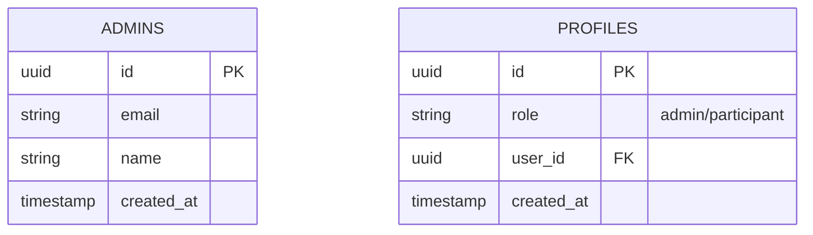
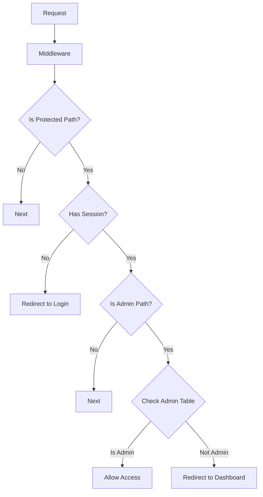
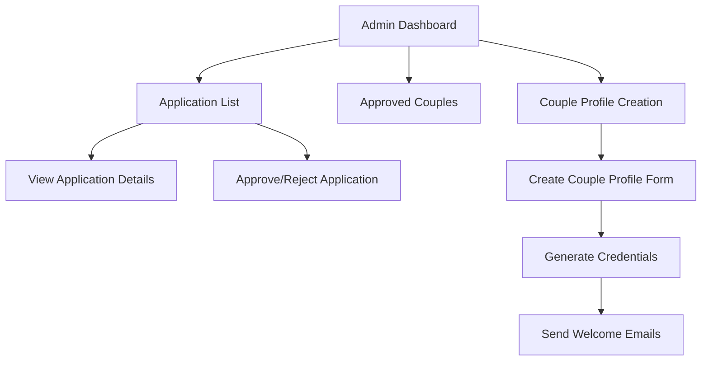

# Detailed Implementation Plan for Phase 1: Admin Authentication

This document outlines the detailed implementation plan for Phase 1 of our authentication system, focusing on the Admin Authentication pathway.

## Phase 1: Admin Authentication Implementation Plan

### 1. Database Schema Updates

First, we need to create the necessary database tables in Supabase:



### 2. Middleware Enhancement

We'll update the middleware to properly check for admin privileges:



### 3. Admin Dashboard Development

We'll create the admin dashboard with the following components:



### 4. Implementation Steps

#### Step 1: Create Admin Table in Supabase

1. Create a new 'admins' table with the following columns:
   - id (uuid, primary key)
   - email (string, unique)
   - name (string)
   - created_at (timestamp)

2. Add initial admin records to the table

#### Step 2: Update Middleware

1. Modify the middleware to check the 'admins' table for admin access:

```typescript
// Enhanced middleware.ts
export async function middleware(request: NextRequest) {
  const res = NextResponse.next();
  const supabase = createMiddlewareClient({ req: request, res });

  const {
    data: { session },
  } = await supabase.auth.getSession();

  // Protected routes
  const protectedPaths = ['/admin', '/dashboard'];
  const isProtectedPath = protectedPaths.some((path) => 
    request.nextUrl.pathname.startsWith(path)
  );

  // Admin-only routes
  const isAdminPath = request.nextUrl.pathname.startsWith('/admin');
  
  if (isProtectedPath) {
    if (!session) {
      // Redirect to login if not authenticated
      return NextResponse.redirect(new URL('/login', request.url));
    }

    if (isAdminPath) {
      const {
        data: { user },
      } = await supabase.auth.getUser();

      // Check if user email is in admins table
      const { data: adminData, error: adminError } = await supabase
        .from('admins')
        .select('*')
        .eq('email', user?.email)
        .single();

      if (!adminData) {
        // Redirect non-admin users to dashboard
        return NextResponse.redirect(new URL('/dashboard', request.url));
      }
    }
  }

  return res;
}
```

#### Step 3: Create Admin Dashboard Pages

1. Create the main admin dashboard page:

```typescript
// src/app/admin/page.tsx
import { createServerComponentClient } from '@supabase/auth-helpers-nextjs';
import { cookies } from 'next/headers';
import Link from 'next/link';

export default async function AdminDashboard() {
  const supabase = createServerComponentClient({ cookies });
  
  // Get applications count
  const { count: applicationsCount } = await supabase
    .from('applications')
    .select('*', { count: 'exact', head: true });
    
  // Get approved applications count
  const { count: approvedCount } = await supabase
    .from('applications')
    .select('*', { count: 'exact', head: true })
    .eq('status', 'approved');
  
  return (
    <div className="container mx-auto px-4 py-8">
      <h1 className="text-2xl font-bold mb-6">Admin Dashboard</h1>
      
      <div className="grid grid-cols-1 md:grid-cols-3 gap-6 mb-8">
        <div className="bg-white p-6 rounded-lg shadow">
          <h2 className="text-lg font-semibold mb-2">Applications</h2>
          <p className="text-3xl font-bold">{applicationsCount}</p>
          <Link href="/admin/applications" className="text-blue-600 hover:underline mt-2 inline-block">
            View all applications
          </Link>
        </div>
        
        <div className="bg-white p-6 rounded-lg shadow">
          <h2 className="text-lg font-semibold mb-2">Approved Couples</h2>
          <p className="text-3xl font-bold">{approvedCount}</p>
          <Link href="/admin/couples" className="text-blue-600 hover:underline mt-2 inline-block">
            View approved couples
          </Link>
        </div>
        
        <div className="bg-white p-6 rounded-lg shadow">
          <h2 className="text-lg font-semibold mb-2">Create Profile</h2>
          <p className="text-sm mb-2">Create a new couple profile for approved applications</p>
          <Link href="/admin/create-profile" className="bg-blue-600 text-white px-4 py-2 rounded hover:bg-blue-700 inline-block">
            Create Profile
          </Link>
        </div>
      </div>
    </div>
  );
}
```

2. Create the applications list page:

```typescript
// src/app/admin/applications/page.tsx
import { createServerComponentClient } from '@supabase/auth-helpers-nextjs';
import { cookies } from 'next/headers';
import Link from 'next/link';

export default async function ApplicationsList() {
  const supabase = createServerComponentClient({ cookies });
  
  const { data: applications, error } = await supabase
    .from('applications')
    .select('*')
    .order('submitted_at', { ascending: false });
  
  if (error) {
    console.error('Error fetching applications:', error);
  }
  
  return (
    <div className="container mx-auto px-4 py-8">
      <h1 className="text-2xl font-bold mb-6">Applications</h1>
      
      <div className="bg-white rounded-lg shadow overflow-hidden">
        <table className="min-w-full divide-y divide-gray-200">
          <thead className="bg-gray-50">
            <tr>
              <th className="px-6 py-3 text-left text-xs font-medium text-gray-500 uppercase tracking-wider">
                Couple
              </th>
              <th className="px-6 py-3 text-left text-xs font-medium text-gray-500 uppercase tracking-wider">
                Retreat Date
              </th>
              <th className="px-6 py-3 text-left text-xs font-medium text-gray-500 uppercase tracking-wider">
                Submitted
              </th>
              <th className="px-6 py-3 text-left text-xs font-medium text-gray-500 uppercase tracking-wider">
                Status
              </th>
              <th className="px-6 py-3 text-left text-xs font-medium text-gray-500 uppercase tracking-wider">
                Actions
              </th>
            </tr>
          </thead>
          <tbody className="bg-white divide-y divide-gray-200">
            {applications?.map((app) => (
              <tr key={app.id}>
                <td className="px-6 py-4 whitespace-nowrap">
                  <div className="text-sm font-medium text-gray-900">
                    {app.his_name.first} {app.his_name.last} & {app.her_name.first} {app.her_name.last}
                  </div>
                </td>
                <td className="px-6 py-4 whitespace-nowrap">
                  <div className="text-sm text-gray-500">{app.retreat_date}</div>
                </td>
                <td className="px-6 py-4 whitespace-nowrap">
                  <div className="text-sm text-gray-500">
                    {new Date(app.submitted_at).toLocaleDateString()}
                  </div>
                </td>
                <td className="px-6 py-4 whitespace-nowrap">
                  <span className={`px-2 inline-flex text-xs leading-5 font-semibold rounded-full 
                    ${app.status === 'approved' ? 'bg-green-100 text-green-800' : 
                      app.status === 'rejected' ? 'bg-red-100 text-red-800' : 
                      'bg-yellow-100 text-yellow-800'}`}>
                    {app.status}
                  </span>
                </td>
                <td className="px-6 py-4 whitespace-nowrap text-sm font-medium">
                  <Link href={`/admin/applications/${app.id}`} className="text-blue-600 hover:text-blue-900 mr-4">
                    View
                  </Link>
                  {app.status === 'pending' && (
                    <>
                      <button className="text-green-600 hover:text-green-900 mr-4">
                        Approve
                      </button>
                      <button className="text-red-600 hover:text-red-900">
                        Reject
                      </button>
                    </>
                  )}
                  {app.status === 'approved' && !app.profile_created && (
                    <Link href={`/admin/create-profile?application=${app.id}`} className="text-purple-600 hover:text-purple-900">
                      Create Profile
                    </Link>
                  )}
                </td>
              </tr>
            ))}
          </tbody>
        </table>
      </div>
    </div>
  );
}
```

#### Step 4: Create Couple Profile Creation Form

```typescript
// src/app/admin/create-profile/page.tsx
'use client';

import { useState, useEffect } from 'react';
import { useRouter, useSearchParams } from 'next/navigation';
import { createClientComponentClient } from '@supabase/auth-helpers-nextjs';

export default function CreateProfile() {
  const router = useRouter();
  const searchParams = useSearchParams();
  const applicationId = searchParams.get('application');
  const supabase = createClientComponentClient();
  
  const [loading, setLoading] = useState(false);
  const [application, setApplication] = useState(null);
  const [formData, setFormData] = useState({
    retreatDate: '',
    husbandFirstName: '',
    husbandLastName: '',
    husbandEmail: '',
    wifeFirstName: '',
    wifeLastName: '',
    wifeEmail: '',
    feeAmount: '',
    hasPaymentPlan: 'no',
    paymentPlanType: 'fixed',
    paymentCadence: 'monthly',
    numberOfPayments: 1,
    variablePayments: [{ amount: '', dueDate: '' }]
  });
  
  useEffect(() => {
    if (applicationId) {
      fetchApplication(applicationId);
    }
  }, [applicationId]);
  
  const fetchApplication = async (id) => {
    setLoading(true);
    const { data, error } = await supabase
      .from('applications')
      .select('*')
      .eq('id', id)
      .single();
      
    if (error) {
      console.error('Error fetching application:', error);
    } else if (data) {
      setApplication(data);
      setFormData({
        ...formData,
        retreatDate: data.retreat_date,
        husbandFirstName: data.his_name.first,
        husbandLastName: data.his_name.last,
        husbandEmail: data.his_email,
        wifeFirstName: data.her_name.first,
        wifeLastName: data.her_name.last,
        wifeEmail: data.her_email
      });
    }
    setLoading(false);
  };
  
  const handleSubmit = async (e) => {
    e.preventDefault();
    setLoading(true);
    
    try {
      // 1. Create profile record
      const profileData = {
        application_id: applicationId,
        husband_first_name: formData.husbandFirstName,
        husband_last_name: formData.husbandLastName,
        husband_email: formData.husbandEmail,
        wife_first_name: formData.wifeFirstName,
        wife_last_name: formData.wifeLastName,
        wife_email: formData.wifeEmail,
        retreat_date: formData.retreatDate,
        fee_amount: parseFloat(formData.feeAmount),
        payment_plan_type: formData.hasPaymentPlan === 'yes' ? formData.paymentPlanType : null,
        payment_cadence: formData.paymentPlanType === 'fixed' ? formData.paymentCadence : null,
        number_of_payments: formData.paymentPlanType === 'variable' ? parseInt(formData.numberOfPayments) : null,
        variable_payments: formData.paymentPlanType === 'variable' ? formData.variablePayments : null,
        created_at: new Date().toISOString()
      };
      
      const { data: profile, error: profileError } = await supabase
        .from('profiles')
        .insert(profileData)
        .select()
        .single();
        
      if (profileError) throw profileError;
      
      // 2. Create user accounts and send welcome emails
      const { error: apiError } = await fetch('/api/admin/create-couple-accounts', {
        method: 'POST',
        headers: {
          'Content-Type': 'application/json',
        },
        body: JSON.stringify({
          profileId: profile.id,
          husbandEmail: formData.husbandEmail,
          wifeEmail: formData.wifeEmail,
        }),
      }).then(res => res.json());
      
      if (apiError) throw new Error(apiError);
      
      // 3. Update application status
      await supabase
        .from('applications')
        .update({ profile_created: true })
        .eq('id', applicationId);
      
      // 4. Redirect to success page
      router.push('/admin/couples');
      
    } catch (error) {
      console.error('Error creating profile:', error);
      alert('Failed to create profile. Please try again.');
    } finally {
      setLoading(false);
    }
  };
  
  // Form rendering with all the fields...
  // (Form UI implementation with all the fields from the requirements)
}
```

#### Step 5: Create API Route for Account Creation

```typescript
// src/app/api/admin/create-couple-accounts/route.ts
import { NextResponse } from 'next/server';
import { createClient } from '@supabase/supabase-js';
import { Resend } from 'resend';
import { generateTemporaryPassword } from '@/lib/auth-utils';

const supabase = createClient(
  process.env.NEXT_PUBLIC_SUPABASE_URL!,
  process.env.SUPABASE_SERVICE_KEY!
);

const resend = new Resend(process.env.RESEND_API_KEY);

export async function POST(request: Request) {
  try {
    const { profileId, husbandEmail, wifeEmail } = await request.json();
    
    if (!profileId || !husbandEmail || !wifeEmail) {
      return NextResponse.json(
        { error: 'Missing required fields' },
        { status: 400 }
      );
    }
    
    // Generate temporary passwords
    const husbandPassword = generateTemporaryPassword();
    const wifePassword = generateTemporaryPassword();
    
    // Create husband account
    const { data: husbandData, error: husbandError } = await supabase.auth.admin.createUser({
      email: husbandEmail,
      password: husbandPassword,
      email_confirm: true,
      user_metadata: {
        profile_id: profileId,
        role: 'participant',
        gender: 'husband'
      }
    });
    
    if (husbandError) throw husbandError;
    
    // Create wife account
    const { data: wifeData, error: wifeError } = await supabase.auth.admin.createUser({
      email: wifeEmail,
      password: wifePassword,
      email_confirm: true,
      user_metadata: {
        profile_id: profileId,
        role: 'participant',
        gender: 'wife'
      }
    });
    
    if (wifeError) throw wifeError;
    
    // Get profile data for email
    const { data: profile, error: profileError } = await supabase
      .from('profiles')
      .select('*')
      .eq('id', profileId)
      .single();
      
    if (profileError) throw profileError;
    
    // Send welcome emails with credentials
    await Promise.all([
      resend.emails.send({
        from: 'Oasis Retreat <noreply@oasisretreat.com>',
        to: [husbandEmail],
        subject: 'Welcome to Oasis Retreat - Your Login Credentials',
        html: getWelcomeEmailTemplate({
          name: `${profile.husband_first_name} ${profile.husband_last_name}`,
          email: husbandEmail,
          password: husbandPassword,
          retreatDate: profile.retreat_date,
          paymentInfo: getPaymentInfoText(profile)
        })
      }),
      
      resend.emails.send({
        from: 'Oasis Retreat <noreply@oasisretreat.com>',
        to: [wifeEmail],
        subject: 'Welcome to Oasis Retreat - Your Login Credentials',
        html: getWelcomeEmailTemplate({
          name: `${profile.wife_first_name} ${profile.wife_last_name}`,
          email: wifeEmail,
          password: wifePassword,
          retreatDate: profile.retreat_date,
          paymentInfo: getPaymentInfoText(profile)
        })
      })
    ]);
    
    return NextResponse.json({ success: true });
    
  } catch (error) {
    console.error('Error creating accounts:', error);
    return NextResponse.json(
      { error: error instanceof Error ? error.message : 'Unknown error' },
      { status: 500 }
    );
  }
}

function getWelcomeEmailTemplate({ name, email, password, retreatDate, paymentInfo }) {
  return `
    <h1>Welcome to Oasis Retreat!</h1>
    <p>Dear ${name},</p>
    <p>Your application for the Oasis Retreat on ${retreatDate} has been approved!</p>
    <p>You can now log in to your dashboard using the following credentials:</p>
    <p><strong>Username:</strong> ${email}<br>
    <strong>Temporary Password:</strong> ${password}</p>
    <p>Please log in and change your password as soon as possible.</p>
    <h2>Payment Information</h2>
    ${paymentInfo}
    <p>Please complete the checklist in your dashboard to prepare for the retreat.</p>
    <p>We look forward to seeing you!</p>
    <p>The Oasis Retreat Team</p>
  `;
}

function getPaymentInfoText(profile) {
  if (!profile.payment_plan_type) {
    return `<p>Total Fee: $${profile.fee_amount}</p>
            <p>Please make the full payment before the retreat.</p>`;
  }
  
  if (profile.payment_plan_type === 'fixed') {
    // Calculate payment amount based on cadence
    const totalPayments = getNumberOfPayments(profile.retreat_date, profile.payment_cadence);
    const paymentAmount = (profile.fee_amount / totalPayments).toFixed(2);
    
    return `<p>Total Fee: $${profile.fee_amount}</p>
            <p>Payment Plan: ${totalPayments} ${profile.payment_cadence} payments of $${paymentAmount}</p>`;
  }
  
  if (profile.payment_plan_type === 'variable') {
    const paymentsList = profile.variable_payments.map(p => 
      `<li>$${p.amount} due on ${new Date(p.dueDate).toLocaleDateString()}</li>`
    ).join('');
    
    return `<p>Total Fee: $${profile.fee_amount}</p>
            <p>Variable Payment Plan:</p>
            <ul>${paymentsList}</ul>`;
  }
  
  return '';
}

function getNumberOfPayments(retreatDate, cadence) {
  const now = new Date();
  const retreat = new Date(retreatDate);
  const weeksBefore = 1; // One week before retreat
  
  const endDate = new Date(retreat);
  endDate.setDate(endDate.getDate() - (7 * weeksBefore));
  
  const totalDays = Math.floor((endDate.getTime() - now.getTime()) / (1000 * 60 * 60 * 24));
  
  switch (cadence) {
    case 'weekly':
      return Math.max(1, Math.floor(totalDays / 7));
    case 'biweekly':
      return Math.max(1, Math.floor(totalDays / 14));
    case 'monthly':
      return Math.max(1, Math.floor(totalDays / 30));
    default:
      return 1;
  }
}
```

#### Step 6: Create Auth Utilities

```typescript
// src/lib/auth-utils.ts
export function generateTemporaryPassword(length = 10) {
  const charset = 'ABCDEFGHIJKLMNOPQRSTUVWXYZabcdefghijklmnopqrstuvwxyz0123456789!@#$%^&*';
  let password = '';
  
  for (let i = 0; i < length; i++) {
    const randomIndex = Math.floor(Math.random() * charset.length);
    password += charset[randomIndex];
  }
  
  return password;
}
```

## Next Steps After Phase 1

Once Phase 1 is implemented, we'll have:

1. A functioning admin authentication system
2. The ability to view and manage applications
3. A form to create couple profiles for approved applications
4. Automatic account creation and welcome emails for participants

This will set the foundation for Phase 2, where we'll implement the participant authentication pathway and dashboard.