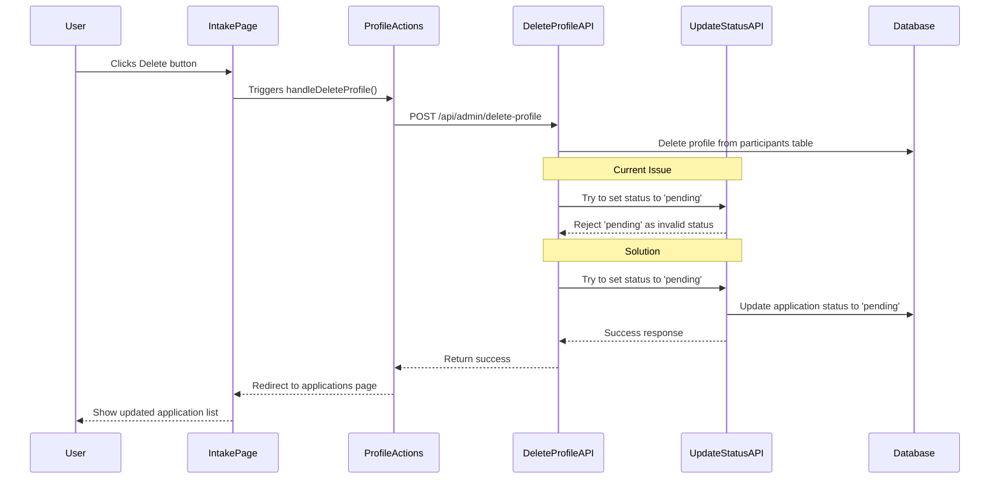

# Root Cause Analysis and Solution Plan for Intake Delete Button Issue

## Problem Statement
The delete button click on the intake page does not remove the application entry or result in a change in status on the application page. The status for the deleted samples remains set to 'approved' in the database.

## Root Cause Analysis

After examining the relevant code files, I've identified the root cause of this issue:

1. When a user clicks the delete button on the intake page, the `ProfileActions` component calls the `/api/admin/delete-profile` endpoint.

2. The delete-profile API endpoint (`src/app/api/admin/delete-profile/route.ts`) attempts to:
   - Delete the profile from the participants table
   - Reset the application status to 'pending'
   - Set profile_created to false

3. However, there's a validation issue in the update-application-status API endpoint (`src/app/api/admin/update-application-status/route.ts`):
   ```typescript
   // Validate status
   if (status !== 'approved' && status !== 'rejected') {
     return NextResponse.json(
       { error: 'Invalid status value' },
       { status: 400 }
     );
   }
   ```

4. This validation only allows 'approved' or 'rejected' as valid status values, but not 'pending'. This means that when the delete-profile endpoint tries to set the status to 'pending', it's being rejected by the validation logic.

5. As a result, the status remains 'approved' in the database even after deletion, which is why the applications page still shows the deleted entries as 'approved'.

## Solution Plan

To fix this issue, we need to modify the `update-application-status` endpoint to accept 'pending' as a valid status. Here's the plan:

### 1. Update the validation in update-application-status endpoint

```typescript
// Current validation
if (status !== 'approved' && status !== 'rejected') {
  return NextResponse.json(
    { error: 'Invalid status value' },
    { status: 400 }
  );
}

// Updated validation
if (!['approved', 'rejected', 'pending', 'follow_up'].includes(status)) {
  return NextResponse.json(
    { error: `Invalid status value: ${status}` },
    { status: 400 }
  );
}
```

This change will allow the endpoint to accept 'pending' and 'follow_up' as valid status values, making it more flexible and consistent with the application's needs.

### 2. Add logging to verify the status change

In the delete-profile endpoint, we should add additional logging to verify that the status change is being attempted:

```typescript
console.log(`Attempting to update application ${applicationId} status to 'pending'`);
// ... update code ...
console.log(`Verification result after update: ${JSON.stringify(verifyData)}`);
```

### 3. Test the solution

After implementing these changes, we should test the delete functionality on the intake page and verify that:
- The profile is deleted from the participants table
- The application status is changed to 'pending' in the database
- The applications page reflects the updated status

## Workflow Diagram



## Implementation Steps

1. Modify the validation logic in `src/app/api/admin/update-application-status/route.ts` to accept 'pending' and 'follow_up' as valid status values.

2. Add additional logging in `src/app/api/admin/delete-profile/route.ts` to verify the status change is being attempted and completed successfully.

3. Test the delete functionality on the intake page to ensure it works as expected.

4. Verify that the application status changes to 'pending' in the database and that the applications page reflects this change.

This solution addresses the root cause of the issue by allowing the delete-profile endpoint to successfully update the application status to 'pending', ensuring that deleted profiles are properly reflected in the applications page.