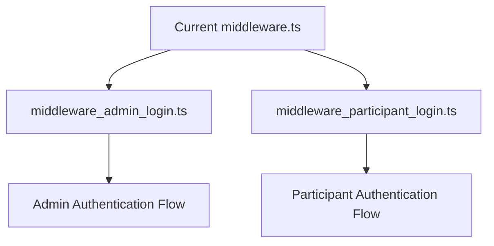
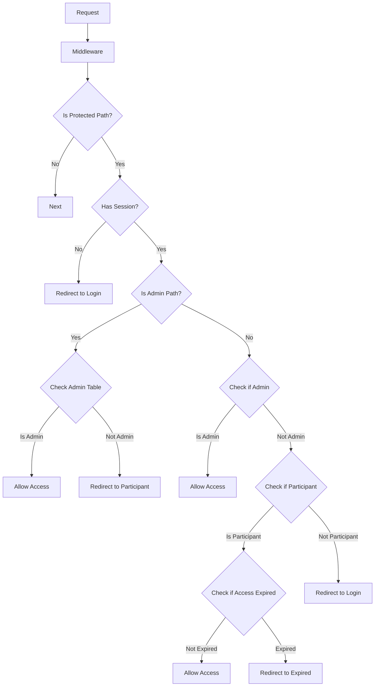

# Middleware Separation Implementation Plan

This document outlines the detailed plan for separating the current middleware into two distinct middleware functions for admin and participant authentication.

## Overview

The current middleware handles both admin and participant authentication in a single file. This plan details how to separate these concerns into two dedicated middleware files:

1. `middleware_admin_login.ts` - Handling admin authentication
2. `middleware_participant_login.ts` - Handling participant authentication



## Current Middleware Analysis

The current middleware handles both admin and participant authentication with shared logic:



## Implementation Steps

### Step 1: Create middleware_participant_login.ts

First, we'll extract the participant authentication logic to a new file:

```typescript
// src/middleware_participant_login.ts
import { createMiddlewareClient } from '@supabase/auth-helpers-nextjs';
import { NextResponse } from 'next/server';
import type { NextRequest } from 'next/server';

export async function middleware(request: NextRequest) {
  const res = NextResponse.next();
  const supabase = createMiddlewareClient({ req: request, res });

  console.log('Participant Middleware processing request for:', request.nextUrl.pathname);
  
  // Check for auth bypass cookies (temporary solution until Supabase Auth is fully working)
  const authBypass = request.cookies.get('auth_bypass');
  const authEmail = request.cookies.get('auth_email');
  let bypassAuth = false;
  let bypassEmail = '';
  
  if (authBypass && authBypass.value === 'true' && authEmail) {
    console.log(`Auth bypass for: ${authEmail.value}`);
    bypassAuth = true;
    bypassEmail = authEmail.value;
  } else {
    console.log('No auth bypass cookies found');
  }

  // Get Supabase session
  const {
    data: { session },
  } = await supabase.auth.getSession();
  
  console.log('Session exists:', !!session);

  // Login pages should be excluded from protection
  const isLoginPath = request.nextUrl.pathname === '/participant/login';
  
  // Only process participant paths and exclude login page
  const isParticipantPath = request.nextUrl.pathname.startsWith('/participant') && !isLoginPath;

  if (isParticipantPath) {
    console.log('Accessing participant path:', request.nextUrl.pathname);
    console.log('Auth status - Session:', !!session, 'Bypass:', bypassAuth);
    
    // Allow access if we have a valid session or auth bypass
    if (!session && !bypassAuth) {
      console.log('No valid authentication, redirecting to login');
      
      // Redirect to participant login
      console.log('Redirecting to participant login');
      return NextResponse.redirect(new URL('/participant/login', request.url));
    }
    
    console.log('Authentication valid, proceeding with access check');

    // Get the current user from session or bypass
    let userEmail = '';
    
    if (session) {
      const {
        data: { user },
      } = await supabase.auth.getUser();
      userEmail = user?.email || '';
    } else if (bypassAuth) {
      userEmail = bypassEmail;
    }
    
    if (!userEmail) {
      console.error('No user email found');
      return NextResponse.redirect(new URL('/participant/login', request.url));
    }

    // First check if user is an admin (admins can access participant routes)
    const { data: adminData } = await supabase
      .from('admins')
      .select('*')
      .eq('email', userEmail)
      .single();

    if (!adminData) {
      // If not an admin, check if user is a participant
      const { data: husbandData } = await supabase
        .from('participants')
        .select('*')
        .eq('husband_email', userEmail)
        .maybeSingle();
        
      const { data: wifeData } = await supabase
        .from('participants')
        .select('*')
        .eq('wife_email', userEmail)
        .maybeSingle();
        
      const participantData = husbandData || wifeData;
      
      // If neither an admin nor a participant, redirect to login
      if (!participantData) {
        return NextResponse.redirect(new URL('/participant/login', request.url));
      }
      
      // Check if access has expired (skip this check when using auth_bypass)
      if (participantData.access_expires_at && !bypassAuth) {
        const expirationDate = new Date(participantData.access_expires_at);
        const today = new Date();
        
        // Set both dates to midnight for accurate comparison
        expirationDate.setHours(23, 59, 59, 999);
        today.setHours(0, 0, 0, 0);
        
        console.log('Access expiration check - Today:', today, 'Expires:', expirationDate);
        
        if (today > expirationDate) {
          console.log('Access has expired, redirecting to access-expired page');
          // Sign out the user if access has expired
          await supabase.auth.signOut();
          return NextResponse.redirect(new URL('/access-expired', request.url));
        }
        
        console.log('Access is still valid');
      } else {
        console.log('No expiration date or using auth bypass, skipping expiration check');
      }
    }
  }

  return res;
}

export const config = {
  matcher: [
    '/participant/:path*',
  ],
};
```

### Step 2: Create middleware_admin_login.ts

Next, we'll extract the admin authentication logic to a new file:

```typescript
// src/middleware_admin_login.ts
import { createMiddlewareClient } from '@supabase/auth-helpers-nextjs';
import { NextResponse } from 'next/server';
import type { NextRequest } from 'next/server';

export async function middleware(request: NextRequest) {
  const res = NextResponse.next();
  const supabase = createMiddlewareClient({ req: request, res });

  console.log('Admin Middleware processing request for:', request.nextUrl.pathname);
  
  // Check for auth bypass cookies (temporary solution until Supabase Auth is fully working)
  const authBypass = request.cookies.get('auth_bypass');
  const authEmail = request.cookies.get('auth_email');
  let bypassAuth = false;
  let bypassEmail = '';
  
  if (authBypass && authBypass.value === 'true' && authEmail) {
    console.log(`Auth bypass for: ${authEmail.value}`);
    bypassAuth = true;
    bypassEmail = authEmail.value;
  } else {
    console.log('No auth bypass cookies found');
  }

  // Get Supabase session
  const {
    data: { session },
  } = await supabase.auth.getSession();
  
  console.log('Session exists:', !!session);

  // Login pages should be excluded from protection
  const isLoginPath = request.nextUrl.pathname === '/admin/login';
  
  // Only process admin paths and exclude login page
  const isAdminPath = request.nextUrl.pathname.startsWith('/admin') && !isLoginPath;

  if (isAdminPath) {
    console.log('Accessing admin path:', request.nextUrl.pathname);
    console.log('Auth status - Session:', !!session, 'Bypass:', bypassAuth);
    
    // Allow access if we have a valid session or auth bypass
    if (!session && !bypassAuth) {
      console.log('No valid authentication, redirecting to login');
      
      // Redirect to admin login
      console.log('Redirecting to admin login');
      return NextResponse.redirect(new URL('/admin/login', request.url));
    }
    
    console.log('Authentication valid, proceeding with access check');

    // Get the current user from session or bypass
    let userEmail = '';
    
    if (session) {
      const {
        data: { user },
      } = await supabase.auth.getUser();
      userEmail = user?.email || '';
    } else if (bypassAuth) {
      userEmail = bypassEmail;
    }
    
    if (!userEmail) {
      console.error('No user email found');
      return NextResponse.redirect(new URL('/admin/login', request.url));
    }

    // Check if user is in the admins table
    const { data: adminData } = await supabase
      .from('admins')
      .select('*')
      .eq('email', userEmail)
      .single();

    if (!adminData) {
      // Redirect non-admin users to participant dashboard
      return NextResponse.redirect(new URL('/participant', request.url));
    }
  }

  return res;
}

export const config = {
  matcher: [
    '/admin/:path*',
  ],
};
```

### Step 3: Update the Original middleware.ts

We'll update the original middleware.ts to import and re-export both middleware functions:

```typescript
// src/middleware.ts
import { middleware as adminMiddleware } from './middleware_admin_login';
import { middleware as participantMiddleware } from './middleware_participant_login';

// This file is kept for backward compatibility
// The actual middleware logic has been moved to separate files
export { adminMiddleware as middleware };

export const config = {
  matcher: [
    '/admin/:path*',
    '/participant/:path*',
  ],
};
```

## Testing Plan

To ensure the separation doesn't break existing functionality, we'll test:

### Admin Authentication Tests

1. **Admin Login**:
   - Test admin login with valid credentials
   - Test admin login with invalid credentials
   - Test admin login with non-admin credentials

2. **Admin Route Access**:
   - Test accessing admin routes as an admin
   - Test accessing admin routes as a non-admin
   - Test accessing admin routes without authentication

### Participant Authentication Tests

1. **Participant Login**:
   - Test participant login with valid credentials
   - Test participant login with invalid credentials
   - Test participant login with expired access

2. **Participant Route Access**:
   - Test accessing participant routes as a participant
   - Test accessing participant routes as an admin
   - Test accessing participant routes without authentication
   - Test accessing participant routes with expired access

## Rollback Plan

If issues arise, we can quickly revert to the original middleware by:

1. Keeping a backup of the original middleware.ts file
2. Restoring the original file if needed
3. Having a quick rollback command ready in case of deployment issues

## Implementation Approach

### Phased Implementation

1. **Phase 1: Development and Testing**
   - Create the new middleware files without modifying the original
   - Test the new files in a development environment
   - Verify all authentication flows work correctly

2. **Phase 2: Transition**
   - Update the original middleware.ts to use the new files
   - Deploy to a staging environment
   - Verify all authentication flows again

3. **Phase 3: Production Deployment**
   - Deploy to production
   - Monitor for any authentication issues
   - Be ready to roll back if necessary

### Monitoring

During and after deployment, we'll:

1. Add additional logging during the transition
2. Monitor authentication failures closely
3. Track any unexpected redirects
4. Have a team member ready to respond to any issues

## Timeline

1. **Development**: 1-2 days
   - Create new middleware files
   - Initial testing

2. **Testing**: 1-2 days
   - Comprehensive testing of all authentication flows
   - Fix any issues discovered

3. **Deployment**: 1 day
   - Deploy to production
   - Monitor for issues

4. **Verification**: 1-2 days
   - Verify all authentication flows in production
   - Address any issues that arise

## Conclusion

This plan provides a careful approach to separating the middleware while ensuring the existing authentication functionality continues to work correctly. By following this phased implementation approach and thorough testing plan, we can minimize the risk of disruption to users.