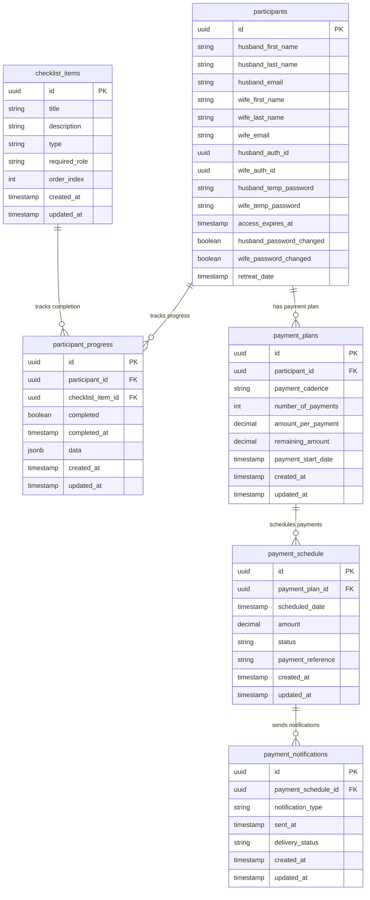
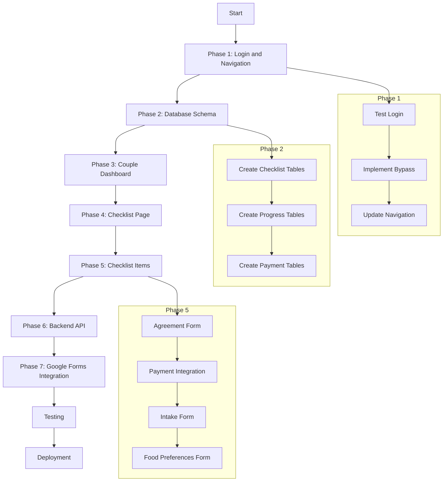

# Participant Portal Implementation Plan

## Overview

This plan outlines the implementation of the Participant Portal with a focus on the checklist functionality that will guide participants through their required tasks before attending the retreat. The portal will provide a streamlined experience for participants to complete necessary forms, make payments, and track their progress.

## Current State Analysis

- Participant login functionality is partially implemented with authentication using Supabase
- Database schema includes fields for participant authentication
- API endpoints exist for creating participant accounts
- Basic dashboard structure exists but needs to be updated according to new requirements

## Requirements Summary

1. **Login Functionality**
   - Test existing login with user credentials generated from admin portal
   - Implement a login bypass for development purposes

2. **Dashboard Navigation**
   - Replace current sidebar with 2 primary navigation links
   - Create dashboard pages for each link (Couple Dashboard and Checklist)

3. **Checklist Functionality**
   - Create a checklist page to guide participants through workflow items
   - Implement tracking for completed vs. pending items
   - Support both individual (husband/wife specific) and couple tasks
   - Track progress for 4 main checklist items:
     - Agreement form (per couple)
     - Payment (per couple)
     - Intake form (per individual)
     - Food preferences form (per individual)

4. **Database Schema**
   - Create tables for tracking checklist items and progress
   - Implement payment tracking system
   - Store form submissions

## Implementation Plan

### Phase 1: Login and Navigation Structure

#### 1.1 Test and Enhance Login Functionality

- Test existing login with generated credentials
- Implement login bypass for development
  ```typescript
  // Development bypass middleware
  export function bypassAuthMiddleware(req: NextRequest) {
    if (process.env.NODE_ENV === 'development') {
      // Set development session cookie
      const response = NextResponse.next();
      response.cookies.set('dev_bypass', 'true', { 
        httpOnly: true,
        path: '/' 
      });
      return response;
    }
    return NextResponse.next();
  }
  ```

#### 1.2 Update Dashboard Navigation

- Replace current sidebar with new navigation structure
- Create new dashboard layout component
  ```tsx
  // src/app/dashboard/layout.tsx
  export default function DashboardLayout({
    children,
  }: {
    children: React.ReactNode;
  }) {
    return (
      <div className="flex min-h-screen bg-gray-50">
        <DashboardNavigation />
        <main className="flex-1 p-6">{children}</main>
      </div>
    );
  }
  ```

- Implement new navigation component
  ```tsx
  // src/components/dashboard/navigation.tsx
  export function DashboardNavigation() {
    const pathname = usePathname();
    
    const navigation = [
      { name: 'Couple Dashboard', href: '/dashboard' },
      { name: 'Checklist', href: '/dashboard/checklist' },
    ];
    
    return (
      <nav className="bg-white p-4 shadow-sm w-full border-b">
        <div className="container mx-auto flex justify-between items-center">
          <div className="flex space-x-8">
            {navigation.map((item) => (
              <Link
                key={item.href}
                href={item.href}
                className={`
                  px-3 py-2 text-sm font-medium rounded-md
                  ${pathname === item.href 
                    ? 'bg-primary text-white' 
                    : 'text-gray-600 hover:text-gray-900 hover:bg-gray-100'}
                `}
              >
                {item.name}
              </Link>
            ))}
          </div>
          <UserMenu />
        </div>
      </nav>
    );
  }
  ```

### Phase 2: Database Schema for Checklist Tracking

#### 2.1 Create Checklist Items Table

```sql
CREATE TABLE checklist_items (
  id UUID PRIMARY KEY DEFAULT uuid_generate_v4(),
  title TEXT NOT NULL,
  description TEXT,
  type TEXT NOT NULL, -- 'couple' or 'individual'
  required_role TEXT, -- 'husband', 'wife', or NULL (for couple items)
  order_index INTEGER NOT NULL,
  created_at TIMESTAMP WITH TIME ZONE DEFAULT NOW(),
  updated_at TIMESTAMP WITH TIME ZONE DEFAULT NOW()
);

-- Insert default checklist items
INSERT INTO checklist_items (title, description, type, required_role, order_index)
VALUES 
  ('Signed Agreement', 'Electronic signature required', 'couple', NULL, 1),
  ('Payment', 'Complete all scheduled payments', 'couple', NULL, 2),
  ('Intake Form', 'Complete personal information', 'individual', 'husband', 3),
  ('Intake Form', 'Complete personal information', 'individual', 'wife', 4),
  ('Food Preferences', 'Indicate dietary restrictions', 'individual', 'husband', 5),
  ('Food Preferences', 'Indicate dietary restrictions', 'individual', 'wife', 6);
```

#### 2.2 Create Participant Progress Table

```sql
CREATE TABLE participant_progress (
  id UUID PRIMARY KEY DEFAULT uuid_generate_v4(),
  participant_id UUID NOT NULL REFERENCES participants(id),
  checklist_item_id UUID NOT NULL REFERENCES checklist_items(id),
  completed BOOLEAN DEFAULT FALSE,
  completed_at TIMESTAMP WITH TIME ZONE,
  data JSONB, -- Store any relevant data related to completion
  created_at TIMESTAMP WITH TIME ZONE DEFAULT NOW(),
  updated_at TIMESTAMP WITH TIME ZONE DEFAULT NOW(),
  UNIQUE(participant_id, checklist_item_id)
);
```

#### 2.3 Create Payment Tracking Tables

```sql
CREATE TABLE payment_plans (
  id UUID PRIMARY KEY DEFAULT uuid_generate_v4(),
  participant_id UUID NOT NULL REFERENCES participants(id),
  payment_cadence TEXT NOT NULL, -- 'weekly', 'bi-weekly', 'monthly'
  number_of_payments INTEGER NOT NULL,
  amount_per_payment DECIMAL NOT NULL,
  remaining_amount DECIMAL(10,2) NOT NULL,
  payment_start_date TIMESTAMP WITH TIME ZONE NOT NULL,
  created_at TIMESTAMP WITH TIME ZONE DEFAULT NOW(),
  updated_at TIMESTAMP WITH TIME ZONE DEFAULT NOW()
);

CREATE TABLE payment_schedule (
  id UUID PRIMARY KEY DEFAULT uuid_generate_v4(),
  payment_plan_id UUID NOT NULL REFERENCES payment_plans(id),
  scheduled_date TIMESTAMP WITH TIME ZONE NOT NULL,
  amount DECIMAL(10,2) NOT NULL,
  status TEXT NOT NULL, -- 'scheduled', 'completed', 'missed'
  payment_reference TEXT, -- Reference from Fellowship One if available
  created_at TIMESTAMP WITH TIME ZONE DEFAULT NOW(),
  updated_at TIMESTAMP WITH TIME ZONE DEFAULT NOW()
);

CREATE TABLE payment_notifications (
  id UUID PRIMARY KEY DEFAULT uuid_generate_v4(),
  payment_schedule_id UUID NOT NULL REFERENCES payment_schedule(id),
  notification_type TEXT NOT NULL, -- 'upcoming', 'overdue', 'confirmation'
  sent_at TIMESTAMP WITH TIME ZONE NOT NULL,
  delivery_status TEXT NOT NULL, -- 'sent', 'failed'
  created_at TIMESTAMP WITH TIME ZONE DEFAULT NOW(),
  updated_at TIMESTAMP WITH TIME ZONE DEFAULT NOW()
);
```

### Phase 3: Couple Dashboard Implementation

#### 3.1 Create Couple Dashboard Page

```tsx
// src/app/dashboard/page.tsx
import { getParticipantData } from '@/lib/participant-utils';
import { DashboardCard } from '@/components/dashboard/dashboard-card';
import { ProgressSummary } from '@/components/dashboard/progress-summary';

export default async function CoupleDashboardPage() {
  const participant = await getParticipantData();
  
  return (
    <div className="space-y-6">
      <h1 className="text-2xl font-bold">Welcome, {participant.husband_first_name} & {participant.wife_first_name}</h1>
      
      <ProgressSummary participantId={participant.id} />
      
      <div className="grid grid-cols-1 md:grid-cols-2 gap-6">
        <DashboardCard
          title="Checklist"
          description="Track your progress through required tasks"
          linkText="View Checklist"
          linkHref="/dashboard/checklist"
        />
        
        <DashboardCard
          title="Retreat Information"
          description="Important details about your upcoming retreat"
          linkText="View Details"
          linkHref="/dashboard/retreat-info"
        />
      </div>
    </div>
  );
}
```

#### 3.2 Create Dashboard Components

```tsx
// src/components/dashboard/progress-summary.tsx
export async function ProgressSummary({ participantId }: { participantId: string }) {
  const progress = await getParticipantProgress(participantId);
  const totalItems = progress.totalItems;
  const completedItems = progress.completedItems;
  const percentComplete = Math.round((completedItems / totalItems) * 100);
  
  return (
    <div className="bg-white p-6 rounded-lg shadow">
      <h2 className="text-lg font-medium mb-4">Your Progress</h2>
      
      <div className="w-full bg-gray-200 rounded-full h-2.5">
        <div 
          className="bg-primary h-2.5 rounded-full" 
          style={{ width: `${percentComplete}%` }}
        ></div>
      </div>
      
      <p className="mt-2 text-sm text-gray-600">
        {completedItems} of {totalItems} tasks completed ({percentComplete}%)
      </p>
    </div>
  );
}
```

### Phase 4: Checklist Page Implementation

#### 4.1 Create Checklist Page

```tsx
// src/app/dashboard/checklist/page.tsx
import { getParticipantData } from '@/lib/participant-utils';
import { getChecklistItems } from '@/lib/checklist-utils';
import { ChecklistItem } from '@/components/dashboard/checklist-item';

export default async function ChecklistPage() {
  const participant = await getParticipantData();
  const checklistItems = await getChecklistItems(participant.id);
  
  return (
    <div className="space-y-6">
      <div className="flex justify-between items-center">
        <h1 className="text-2xl font-bold">Couple Checklist</h1>
        <span className="text-sm text-gray-500">
          {checklistItems.filter(item => item.completed).length} of {checklistItems.length} completed
        </span>
      </div>
      
      <div className="bg-white rounded-lg shadow divide-y">
        {checklistItems.map((item) => (
          <ChecklistItem 
            key={item.id}
            item={item}
            participantId={participant.id}
          />
        ))}
      </div>
    </div>
  );
}
```

#### 4.2 Create Checklist Components

```tsx
// src/components/dashboard/checklist-item.tsx
"use client";

import { useState } from 'react';
import { CheckCircle, Circle } from 'lucide-react';
import { Button } from '@/components/ui/button';
import { updateChecklistItemStatus } from '@/lib/checklist-actions';

interface ChecklistItemProps {
  item: {
    id: string;
    title: string;
    description: string;
    type: 'couple' | 'individual';
    requiredRole: 'husband' | 'wife' | null;
    completed: boolean;
    actionUrl?: string;
  };
  participantId: string;
}

export function ChecklistItem({ item, participantId }: ChecklistItemProps) {
  const [isCompleted, setIsCompleted] = useState(item.completed);
  const [isLoading, setIsLoading] = useState(false);
  
  const handleAction = async () => {
    if (item.actionUrl) {
      window.location.href = item.actionUrl;
    } else if (item.title === 'Payment') {
      // Open payment iframe
      // Implementation depends on the payment portal integration
    }
  };
  
  return (
    <div className="p-6 flex items-start space-x-4">
      <div className="flex-shrink-0 pt-1">
        {isCompleted ? (
          <CheckCircle className="h-6 w-6 text-green-500" />
        ) : (
          <Circle className="h-6 w-6 text-gray-300" />
        )}
      </div>
      
      <div className="flex-1 min-w-0">
        <div className="flex justify-between">
          <h3 className="text-lg font-medium text-gray-900">{item.title}</h3>
          {item.requiredRole && (
            <span className="inline-flex items-center px-2.5 py-0.5 rounded-full text-xs font-medium bg-blue-100 text-blue-800">
              {item.requiredRole === 'husband' ? 'Husband' : 'Wife'}
            </span>
          )}
        </div>
        
        <p className="mt-1 text-sm text-gray-500">{item.description}</p>
        
        {!isCompleted && (
          <div className="mt-4">
            <Button 
              onClick={handleAction}
              disabled={isLoading}
              className="text-sm"
            >
              {isLoading ? 'Loading...' : `Complete ${item.title}`}
            </Button>
          </div>
        )}
      </div>
    </div>
  );
}
```

### Phase 5: Checklist Item Implementations

#### 5.1 Agreement Form

```tsx
// src/app/dashboard/checklist/agreement/page.tsx
import { getParticipantData } from '@/lib/participant-utils';
import { AgreementForm } from '@/components/forms/agreement-form';

export default async function AgreementPage() {
  const participant = await getParticipantData();
  
  return (
    <div className="space-y-6">
      <h1 className="text-2xl font-bold">Retreat Agreement</h1>
      <p className="text-gray-600">
        Please review the agreement carefully and sign electronically at the bottom.
      </p>
      
      <div className="bg-white p-6 rounded-lg shadow">
        <AgreementForm 
          participantId={participant.id}
          husbandName={participant.husband_first_name}
          wifeName={participant.wife_first_name}
        />
      </div>
    </div>
  );
}
```

#### 5.2 Payment Integration

```tsx
// src/app/dashboard/checklist/payment/page.tsx
import { getParticipantData } from '@/lib/participant-utils';
import { getPaymentPlan, getPaymentSchedule } from '@/lib/payment-utils';
import { PaymentScheduleTable } from '@/components/payment/payment-schedule-table';
import { PaymentIframe } from '@/components/payment/payment-iframe';

export default async function PaymentPage() {
  const participant = await getParticipantData();
  const paymentPlan = await getPaymentPlan(participant.id);
  const paymentSchedule = await getPaymentSchedule(paymentPlan?.id);
  
  return (
    <div className="space-y-6">
      <h1 className="text-2xl font-bold">Payment</h1>
      
      {paymentPlan ? (
        <>
          <div className="bg-white p-6 rounded-lg shadow">
            <h2 className="text-lg font-medium mb-4">Payment Plan</h2>
            <dl className="grid grid-cols-1 md:grid-cols-2 gap-4">
              <div>
                <dt className="text-sm font-medium text-gray-500">Payment Cadence</dt>
                <dd className="mt-1 text-sm text-gray-900">{paymentPlan.payment_cadence}</dd>
              </div>
              <div>
                <dt className="text-sm font-medium text-gray-500">Number of Payments</dt>
                <dd className="mt-1 text-sm text-gray-900">{paymentPlan.number_of_payments}</dd>
              </div>
              <div>
                <dt className="text-sm font-medium text-gray-500">Amount Per Payment</dt>
                <dd className="mt-1 text-sm text-gray-900">${paymentPlan.amount_per_payment}</dd>
              </div>
              <div>
                <dt className="text-sm font-medium text-gray-500">Remaining Amount</dt>
                <dd className="mt-1 text-sm text-gray-900">${paymentPlan.remaining_amount}</dd>
              </div>
            </dl>
          </div>
          
          <div className="bg-white p-6 rounded-lg shadow">
            <h2 className="text-lg font-medium mb-4">Payment Schedule</h2>
            <PaymentScheduleTable schedule={paymentSchedule} />
          </div>
          
          <div className="bg-white p-6 rounded-lg shadow">
            <h2 className="text-lg font-medium mb-4">Make a Payment</h2>
            <PaymentIframe participantId={participant.id} />
          </div>
        </>
      ) : (
        <div className="bg-white p-6 rounded-lg shadow">
          <p>No payment plan found. Please contact the administrator.</p>
        </div>
      )}
    </div>
  );
}
```

#### 5.3 Intake Form Integration

```tsx
// src/app/dashboard/checklist/intake/page.tsx
import { getParticipantData, getParticipantRole } from '@/lib/participant-utils';
import { IntakeFormIframe } from '@/components/forms/intake-form-iframe';

export default async function IntakePage() {
  const participant = await getParticipantData();
  const role = await getParticipantRole(); // 'husband' or 'wife'
  
  return (
    <div className="space-y-6">
      <h1 className="text-2xl font-bold">Intake Form</h1>
      <p className="text-gray-600">
        Please complete the following intake form with your personal information.
      </p>
      
      <div className="bg-white p-6 rounded-lg shadow">
        <IntakeFormIframe 
          participantId={participant.id}
          role={role}
        />
      </div>
    </div>
  );
}
```

#### 5.4 Food Preferences Form

```tsx
// src/app/dashboard/checklist/food-preferences/page.tsx
import { getParticipantData, getParticipantRole } from '@/lib/participant-utils';
import { FoodPreferencesForm } from '@/components/forms/food-preferences-form';

export default async function FoodPreferencesPage() {
  const participant = await getParticipantData();
  const role = await getParticipantRole(); // 'husband' or 'wife'
  
  return (
    <div className="space-y-6">
      <h1 className="text-2xl font-bold">Food Preferences</h1>
      <p className="text-gray-600">
        Please let us know about any dietary restrictions or preferences.
      </p>
      
      <div className="bg-white p-6 rounded-lg shadow">
        <FoodPreferencesForm 
          participantId={participant.id}
          role={role}
        />
      </div>
    </div>
  );
}
```

### Phase 6: Backend API Implementation

#### 6.1 Checklist API Endpoints

```typescript
// src/app/api/checklist/items/route.ts
import { NextResponse } from 'next/server';
import { createClient } from '@supabase/supabase-js';
import { getParticipantFromSession } from '@/lib/auth-utils';

const supabase = createClient(
  process.env.NEXT_PUBLIC_SUPABASE_URL!,
  process.env.SUPABASE_SERVICE_ROLE_KEY!
);

export async function GET(request: Request) {
  try {
    const participant = await getParticipantFromSession();
    
    if (!participant) {
      return new NextResponse(JSON.stringify({
        error: 'Unauthorized'
      }), { 
        status: 401,
        headers: { 'Content-Type': 'application/json' }
      });
    }
    
    // Get all checklist items
    const { data: checklistItems, error: itemsError } = await supabase
      .from('checklist_items')
      .select('*')
      .order('order_index', { ascending: true });
    
    if (itemsError) {
      return new NextResponse(JSON.stringify({
        error: 'Failed to fetch checklist items',
        details: itemsError.message
      }), { 
        status: 500,
        headers: { 'Content-Type': 'application/json' }
      });
    }
    
    // Get participant progress
    const { data: progress, error: progressError } = await supabase
      .from('participant_progress')
      .select('*')
      .eq('participant_id', participant.id);
    
    if (progressError) {
      return new NextResponse(JSON.stringify({
        error: 'Failed to fetch participant progress',
        details: progressError.message
      }), { 
        status: 500,
        headers: { 'Content-Type': 'application/json' }
      });
    }
    
    // Combine items with progress
    const itemsWithProgress = checklistItems.map(item => {
      const progressItem = progress.find(p => p.checklist_item_id === item.id);
      return {
        ...item,
        completed: progressItem ? progressItem.completed : false,
        completedAt: progressItem ? progressItem.completed_at : null
      };
    });
    
    return new NextResponse(JSON.stringify({
      success: true,
      data: itemsWithProgress
    }), { 
      status: 200,
      headers: { 'Content-Type': 'application/json' }
    });
    
  } catch (error) {
    console.error('Error fetching checklist items:', error);
    return new NextResponse(JSON.stringify({
      error: 'Internal server error',
      details: error instanceof Error ? error.message : 'Unknown error'
    }), { 
      status: 500,
      headers: { 'Content-Type': 'application/json' }
    });
  }
}
```

#### 6.2 Update Checklist Item Status API

```typescript
// src/app/api/checklist/update-status/route.ts
import { NextResponse } from 'next/server';
import { createClient } from '@supabase/supabase-js';
import { getParticipantFromSession } from '@/lib/auth-utils';

const supabase = createClient(
  process.env.NEXT_PUBLIC_SUPABASE_URL!,
  process.env.SUPABASE_SERVICE_ROLE_KEY!
);

export async function POST(request: Request) {
  try {
    const { checklistItemId, completed } = await request.json();
    
    const participant = await getParticipantFromSession();
    
    if (!participant) {
      return new NextResponse(JSON.stringify({
        error: 'Unauthorized'
      }), { 
        status: 401,
        headers: { 'Content-Type': 'application/json' }
      });
    }
    
    // Check if progress record exists
    const { data: existingProgress } = await supabase
      .from('participant_progress')
      .select('*')
      .eq('participant_id', participant.id)
      .eq('checklist_item_id', checklistItemId)
      .single();
    
    if (existingProgress) {
      // Update existing record
      const { error: updateError } = await supabase
        .from('participant_progress')
        .update({
          completed,
          completed_at: completed ? new Date().toISOString() : null,
          updated_at: new Date().toISOString()
        })
        .eq('id', existingProgress.id);
      
      if (updateError) {
        return new NextResponse(JSON.stringify({
          error: 'Failed to update progress',
          details: updateError.message
        }), { 
          status: 500,
          headers: { 'Content-Type': 'application/json' }
        });
      }
    } else {
      // Create new record
      const { error: insertError } = await supabase
        .from('participant_progress')
        .insert({
          participant_id: participant.id,
          checklist_item_id: checklistItemId,
          completed,
          completed_at: completed ? new Date().toISOString() : null
        });
      
      if (insertError) {
        return new NextResponse(JSON.stringify({
          error: 'Failed to create progress record',
          details: insertError.message
        }), { 
          status: 500,
          headers: { 'Content-Type': 'application/json' }
        });
      }
    }
    
    return new NextResponse(JSON.stringify({
      success: true
    }), { 
      status: 200,
      headers: { 'Content-Type': 'application/json' }
    });
    
  } catch (error) {
    console.error('Error updating checklist status:', error);
    return new NextResponse(JSON.stringify({
      error: 'Internal server error',
      details: error instanceof Error ? error.message : 'Unknown error'
    }), { 
      status: 500,
      headers: { 'Content-Type': 'application/json' }
    });
  }
}
```

### Phase 7: Google Forms Integration

#### 7.1 Google Apps Script for Intake Form

```javascript
// Google Apps Script for Intake Form
function doGet(e) {
  return HtmlService.createHtmlOutputFromFile('Form')
    .setTitle('Oasis Retreat Intake Form');
}

function processForm(formData) {
  try {
    // Get the participant ID and role from the URL parameters
    var participantId = formData.participantId;
    var role = formData.role;
    
    // Save to Google Sheets
    var sheet = SpreadsheetApp.getActiveSpreadsheet().getSheetByName('Intake Responses');
    var row = [
      new Date(),
      participantId,
      role,
      formData.firstName,
      formData.lastName,
      formData.email,
      formData.phone,
      formData.address,
      formData.city,
      formData.state,
      formData.zip,
      formData.emergencyContact,
      formData.emergencyPhone,
      formData.medicalConditions,
      formData.medications,
      formData.allergies
    ];
    
    sheet.appendRow(row);
    
    // Call the Oasis API to update the checklist status
    var apiUrl = 'https://oasis-app.vercel.app/api/checklist/update-status';
    var payload = {
      participantId: participantId,
      checklistItemId: role === 'husband' ? 'HUSBAND_INTAKE_FORM_ID' : 'WIFE_INTAKE_FORM_ID',
      completed: true
    };
    
    var options = {
      'method': 'post',
      'contentType': 'application/json',
      'payload': JSON.stringify(payload)
    };
    
    UrlFetchApp.fetch(apiUrl, options);
    
    return {
      success: true,
      message: 'Form submitted successfully'
    };
  } catch (error) {
    return {
      success: false,
      message: 'Error: ' + error.toString()
    };
  }
}
```

#### 7.2 Intake Form Iframe Component

```tsx
// src/components/forms/intake-form-iframe.tsx
"use client";

import { useState, useEffect } from 'react';

interface IntakeFormIframeProps {
  participantId: string;
  role: 'husband' | 'wife';
}

export function IntakeFormIframe({ participantId, role }: IntakeFormIframeProps) {
  const [iframeUrl, setIframeUrl] = useState('');
  const [isLoading, setIsLoading] = useState(true);
  
  useEffect(() => {
    // Google Apps Script published URL
    const baseUrl = 'https://script.google.com/macros/s/YOUR_SCRIPT_ID/exec';
    setIframeUrl(`${baseUrl}?participantId=${participantId}&role=${role}`);
    setIsLoading(false);
  }, [participantId, role]);
  
  if (isLoading) {
    return <div className="flex justify-center p-8">Loading form...</div>;
  }
  
  return (
    <iframe
      src={iframeUrl}
      width="100%"
      height="800px"
      frameBorder="0"
      marginHeight={0}
      marginWidth={0}
    >
      Loading...
    </iframe>
  );
}
```

## Database Schema Diagram



## Implementation Flow



## Testing Strategy

1. **Unit Tests**
   - Test utility functions for checklist and payment management
   - Test API endpoints for proper authentication and data handling
   - Test form validation logic

2. **Integration Tests**
   - Test the flow between different checklist items
   - Test payment tracking and status updates
   - Test Google Forms integration and data storage

3. **End-to-End Tests**
   - Test the complete participant journey from login to completion
   - Test admin access to participant views
   - Test expiration of access based on retreat date

## Deployment Plan

1. Run database migrations to create new tables
2. Deploy backend API changes
3. Deploy frontend components
4. Configure Google Apps Script for form integration
5. Test in staging environment
6. Deploy to production

## Future Enhancements

1. **Email Notifications**
   - Send reminders for incomplete checklist items
   - Notify when new items are added to the checklist

2. **Progress Analytics**
   - Add admin dashboard to track overall participant progress
   - Generate reports on completion rates

3. **Mobile Optimization**
   - Enhance mobile experience for participants completing forms on phones

4. **Offline Support**
   - Add capability to save form progress when offline