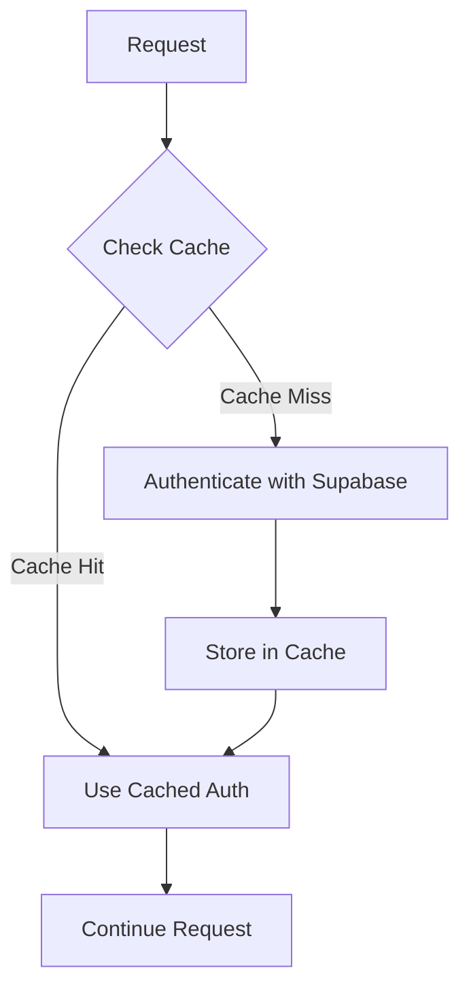
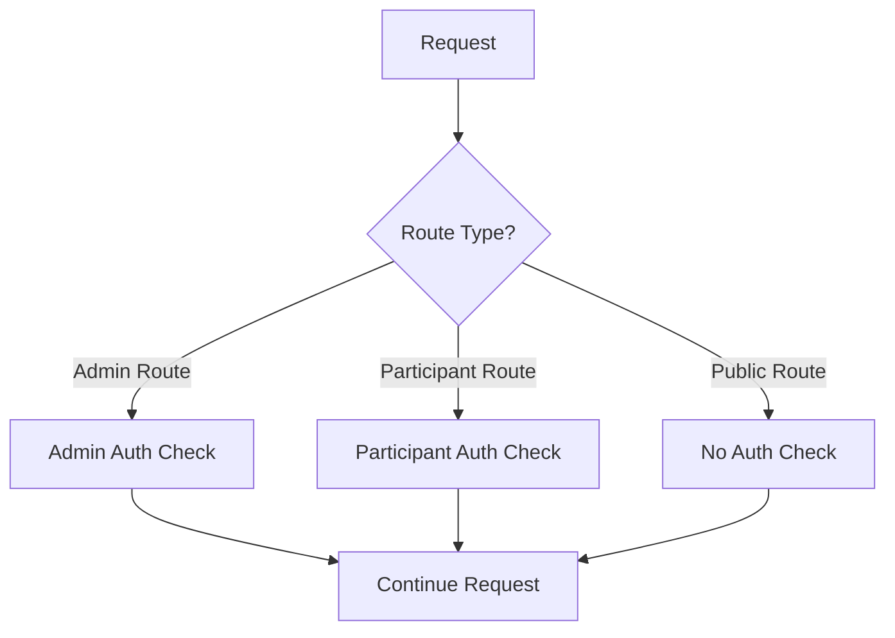
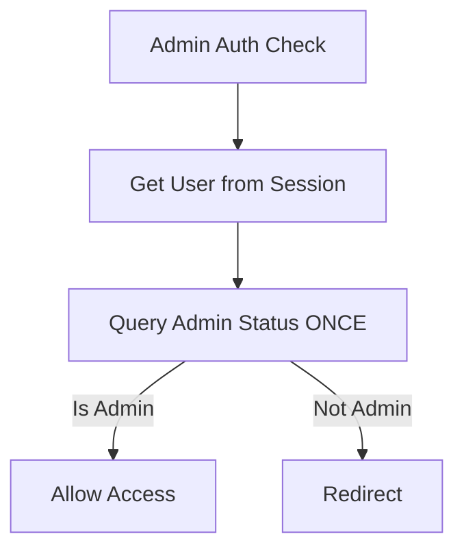
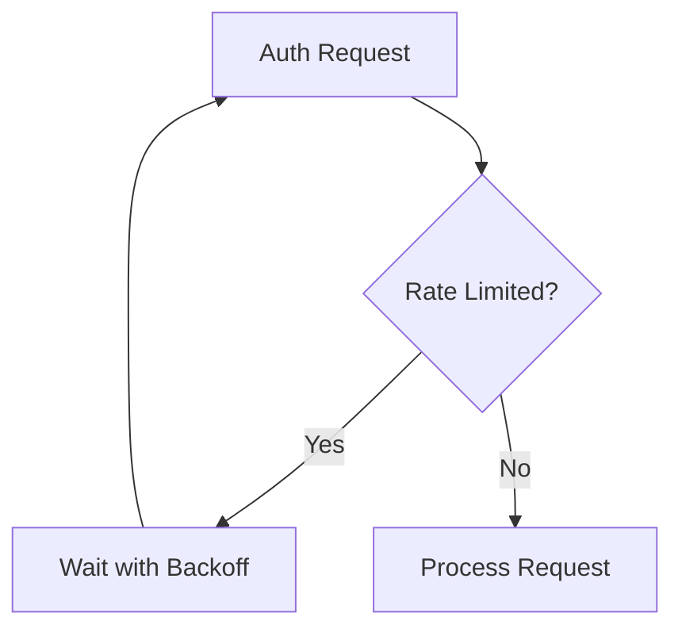

# Implementation Plan: Fixing Supabase Auth Rate Limit Error

## Problem

The application is encountering a rate limit error from Supabase's authentication API during admin login attempts:

```
AuthApiError: Request rate limit reached
```

This error occurs consistently when trying to log in to the admin portal, making it impossible to access the admin functionality.

## Root Cause Analysis

After examining the codebase, I've identified several issues that are likely causing the rate limit error:

1. **Multiple Authentication Checks**: During the admin login process, multiple authentication checks are being performed:
   - Initial login in the form component
   - Subsequent checks in multiple middleware files
   - Additional database queries to verify admin status

2. **Inefficient Middleware Architecture**: The application has several middleware files that might be executing for the same routes, causing duplicate authentication checks.

3. **Suboptimal Admin Verification**: In `middleware_admin_login.ts`, there's an inefficient pattern where it first tries an exact match query, then falls back to fetching ALL admins if that fails.

4. **Multiple Supabase Clients**: Each request creates two Supabase clients (`middlewareSupabase` and `serviceSupabase`), potentially doubling the authentication requests.

5. **Lack of Caching**: Authentication results are not being cached, leading to redundant API calls.

## Solution Plan

### 1. Implement Authentication Caching

The most immediate solution is to implement caching for authentication results to reduce the number of API calls to Supabase.



### 2. Optimize Middleware Architecture

Consolidate the middleware files to avoid duplicate authentication checks and implement a more efficient routing system.



### 3. Improve Admin Verification Logic

Optimize the admin verification process to reduce unnecessary database queries.



### 4. Implement Rate Limiting with Backoff

Add exponential backoff and retry logic for authentication requests to handle rate limiting gracefully.



## Implementation Steps

### 1. Create an Auth Cache Service

Create a new file `src/lib/auth-cache.ts` to implement a server-side cache for authentication results:

```typescript
// Simple in-memory cache for authentication results
const authCache = new Map<string, {
  data: any;
  timestamp: number;
}>();

const CACHE_TTL = 5 * 60 * 1000; // 5 minutes in milliseconds

export function getCachedAuth(key: string) {
  const cached = authCache.get(key);
  if (!cached) return null;
  
  // Check if cache is still valid
  if (Date.now() - cached.timestamp > CACHE_TTL) {
    authCache.delete(key);
    return null;
  }
  
  return cached.data;
}

export function setCachedAuth(key: string, data: any) {
  authCache.set(key, {
    data,
    timestamp: Date.now()
  });
}
```

### 2. Optimize the Auth Middleware

Refactor `src/lib/auth-middleware.ts` to use the cache and implement more efficient authentication:

```typescript
import { getCachedAuth, setCachedAuth } from './auth-cache';

// Add caching to the authenticateRequest function
export async function authenticateRequest(request: NextRequest, options: {...} = {}) {
  // Generate a cache key based on the request
  const cacheKey = `auth:${request.ip}:${request.nextUrl.pathname}`;
  
  // Check cache first
  const cachedResult = getCachedAuth(cacheKey);
  if (cachedResult) {
    return cachedResult;
  }
  
  // Existing authentication logic...
  
  // Cache the result before returning
  const result = { res, supabase: middlewareSupabase, session, user: userData };
  setCachedAuth(cacheKey, result);
  return result;
}
```

### 3. Optimize Admin Verification

Improve the admin verification logic in `middleware_admin_login.ts`:

```typescript
// Replace the two-step admin check with a single, case-insensitive query
const { data: adminData } = await supabase
  .from('admins')
  .select('*')
  .ilike('email', userEmail)
  .maybeSingle();

if (!adminData) {
  console.log('User is not an admin, redirecting to participant dashboard');
  return NextResponse.redirect(new URL('/participant', request.url));
}
```

### 4. Implement Retry Logic with Backoff

Add retry logic with exponential backoff for authentication requests:

```typescript
async function retryWithBackoff(fn: () => Promise<any>, maxRetries = 3) {
  let retries = 0;
  
  while (retries < maxRetries) {
    try {
      return await fn();
    } catch (error: any) {
      if (error?.status === 429) {
        // Rate limit error, wait with exponential backoff
        const waitTime = Math.pow(2, retries) * 1000; // 1s, 2s, 4s
        console.log(`Rate limited, retrying in ${waitTime}ms`);
        await new Promise(resolve => setTimeout(resolve, waitTime));
        retries++;
      } else {
        // Other error, don't retry
        throw error;
      }
    }
  }
  
  // If we've exhausted retries, make one final attempt
  return await fn();
}
```

### 5. Consolidate Middleware Files

Consider consolidating the middleware files into a single, more efficient implementation to avoid duplicate authentication checks.

## Expected Outcome

By implementing these changes, we expect to:

1. Significantly reduce the number of authentication API calls to Supabase
2. Eliminate the rate limit errors during admin login
3. Improve overall application performance by reducing redundant API calls
4. Make the authentication system more resilient to temporary API issues

## Testing Plan

1. Test admin login functionality to ensure it works without rate limit errors
2. Verify that participant login still functions correctly
3. Test navigation between protected routes to ensure middleware is working properly
4. Monitor Supabase API usage to confirm reduction in authentication requests