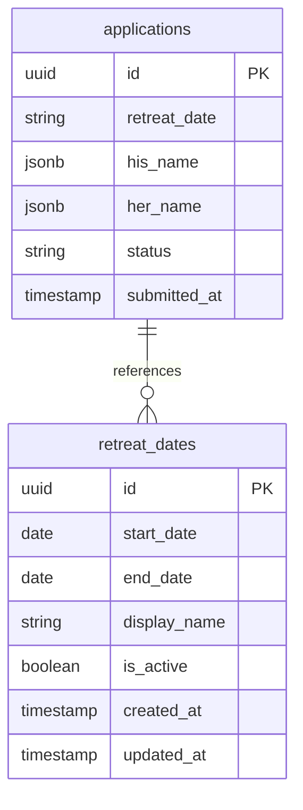
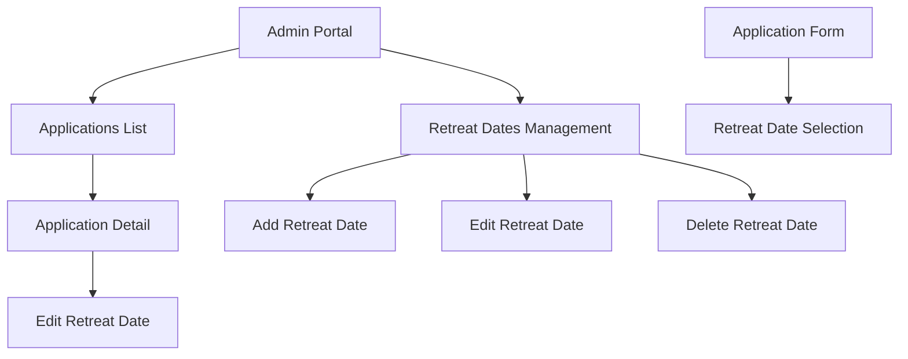
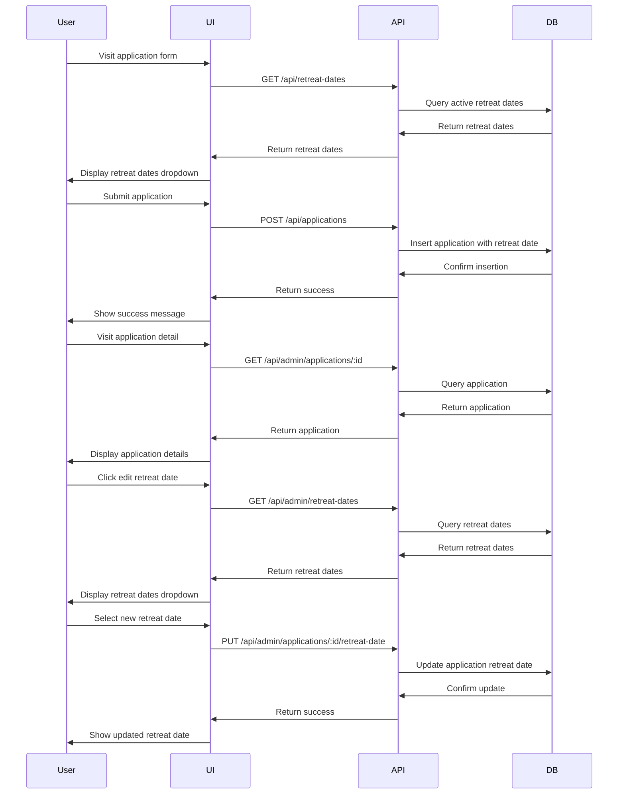

# Retreat Date Management Implementation Plan

Based on my investigation of the codebase, I'll now outline a detailed plan for implementing the ability to edit retreat dates for individual applications and manage a list of available retreat dates that participants can select from when applying.

## Current Implementation

Currently, the retreat date is:
1. Hardcoded in the application form as a single option: "March 5-9, 2025"
2. Stored in the `applications` table as `retreat_date`
3. Displayed in various places throughout the application
4. Not editable from the admin portal

## Requirements

You've requested:
1. The ability to edit the retreat date for individual applications
2. The ability to manage a list of available retreat dates that participants can select when applying
3. The default selection should be the next available retreat date
4. Only future dates should be selectable (past dates should be excluded)
5. Retreat dates will be updated 3-4 times a year

## Implementation Plan

### 1. Database Changes

We need to create a new table to store available retreat dates:

```sql
CREATE TABLE retreat_dates (
  id UUID PRIMARY KEY DEFAULT uuid_generate_v4(),
  start_date DATE NOT NULL,
  end_date DATE NOT NULL,
  display_name TEXT NOT NULL,
  is_active BOOLEAN DEFAULT TRUE,
  created_at TIMESTAMP WITH TIME ZONE DEFAULT NOW(),
  updated_at TIMESTAMP WITH TIME ZONE DEFAULT NOW()
);
```

### 2. API Endpoints

We need to create the following API endpoints:

#### a. Retreat Dates Management
- `GET /api/admin/retreat-dates` - List all retreat dates
- `POST /api/admin/retreat-dates` - Create a new retreat date
- `PUT /api/admin/retreat-dates/:id` - Update a retreat date
- `DELETE /api/admin/retreat-dates/:id` - Delete a retreat date

#### b. Application Retreat Date Update
- `PUT /api/admin/applications/:id/retreat-date` - Update the retreat date for a specific application

### 3. Admin UI Changes

#### a. Retreat Dates Management Page
Create a new page at `/admin/retreat-dates` that allows administrators to:
- View all retreat dates
- Add new retreat dates
- Edit existing retreat dates
- Delete retreat dates
- Toggle active/inactive status

This page should be accessible from the admin sidebar navigation.

#### b. Application Detail Page Update
Update the application detail page to allow editing the retreat date:
- Add an edit button next to the retreat date field
- When clicked, show a dropdown with available retreat dates
- Allow saving the updated retreat date

### 4. Application Form Update

Update the application form to:
- Fetch available retreat dates from the API
- Display them in the dropdown
- Set the default selection to the next available retreat date
- Filter out past dates

### 5. Implementation Steps

Here's a step-by-step approach to implement these changes:

1. **Create Database Table**
   - Create a migration script to add the `retreat_dates` table
   - Seed the table with the current retreat date (March 5-9, 2025)

2. **Create API Endpoints**
   - Implement the retreat dates management endpoints
   - Implement the application retreat date update endpoint

3. **Create Admin UI for Retreat Dates Management**
   - Create the retreat dates management page
   - Add CRUD functionality for retreat dates
   - Add validation to ensure dates are in the future
   - Add the page to the admin navigation

4. **Update Application Detail Page**
   - Add the ability to edit the retreat date for an individual application
   - Implement the UI for selecting a new retreat date
   - Connect to the API endpoint for updating the retreat date

5. **Update Application Form**
   - Modify the form to fetch available retreat dates
   - Update the dropdown to display these dates
   - Implement logic to set the default to the next available date
   - Add filtering to exclude past dates

6. **Testing**
   - Test creating, updating, and deleting retreat dates
   - Test updating retreat dates for individual applications
   - Test the application form with multiple retreat dates
   - Verify that past dates are excluded
   - Verify that the default selection is the next available date

## Technical Design

### 1. Database Schema



### 2. Component Structure



### 3. Data Flow



## Implementation Details

### 1. Retreat Dates API Endpoints

#### `GET /api/admin/retreat-dates`
```typescript
// src/app/api/admin/retreat-dates/route.ts
import { NextResponse } from 'next/server';
import { createClient } from '@supabase/supabase-js';

const supabase = createClient(
  process.env.NEXT_PUBLIC_SUPABASE_URL!,
  process.env.NEXT_PUBLIC_SUPABASE_ANON_KEY!
);

export async function GET() {
  try {
    const { data, error } = await supabase
      .from('retreat_dates')
      .select('*')
      .order('start_date', { ascending: true });
    
    if (error) throw error;
    
    return NextResponse.json({ data });
  } catch (error) {
    console.error('Error fetching retreat dates:', error);
    return NextResponse.json(
      { error: 'Failed to fetch retreat dates' },
      { status: 500 }
    );
  }
}
```

#### `POST /api/admin/retreat-dates`
```typescript
// src/app/api/admin/retreat-dates/route.ts (continued)
export async function POST(request: Request) {
  try {
    const { start_date, end_date, display_name } = await request.json();
    
    // Validate input
    if (!start_date || !end_date || !display_name) {
      return NextResponse.json(
        { error: 'Missing required fields' },
        { status: 400 }
      );
    }
    
    // Ensure dates are in the future
    const now = new Date();
    const startDate = new Date(start_date);
    if (startDate < now) {
      return NextResponse.json(
        { error: 'Start date must be in the future' },
        { status: 400 }
      );
    }
    
    const { data, error } = await supabase
      .from('retreat_dates')
      .insert({
        start_date,
        end_date,
        display_name,
        is_active: true
      })
      .select()
      .single();
    
    if (error) throw error;
    
    return NextResponse.json({ data });
  } catch (error) {
    console.error('Error creating retreat date:', error);
    return NextResponse.json(
      { error: 'Failed to create retreat date' },
      { status: 500 }
    );
  }
}
```

### 2. Application Retreat Date Update Endpoint

```typescript
// src/app/api/admin/applications/[id]/retreat-date/route.ts
import { NextResponse } from 'next/server';
import { createClient } from '@supabase/supabase-js';

const supabase = createClient(
  process.env.NEXT_PUBLIC_SUPABASE_URL!,
  process.env.NEXT_PUBLIC_SUPABASE_ANON_KEY!
);

export async function PUT(
  request: Request,
  { params }: { params: { id: string } }
) {
  try {
    const { retreat_date } = await request.json();
    
    if (!retreat_date) {
      return NextResponse.json(
        { error: 'Retreat date is required' },
        { status: 400 }
      );
    }
    
    const { data, error } = await supabase
      .from('applications')
      .update({ retreat_date })
      .eq('id', params.id)
      .select()
      .single();
    
    if (error) throw error;
    
    return NextResponse.json({ data });
  } catch (error) {
    console.error('Error updating application retreat date:', error);
    return NextResponse.json(
      { error: 'Failed to update application retreat date' },
      { status: 500 }
    );
  }
}
```

### 3. Retreat Dates Management UI

```tsx
// src/app/admin/retreat-dates/page.tsx
import { createServerComponentClient } from '@supabase/auth-helpers-nextjs';
import { cookies } from 'next/headers';
import { AdminLayout } from '@/components/admin/admin-layout';
import { RetreatDatesManager } from '@/components/admin/retreat-dates-manager';

export const dynamic = 'force-dynamic';
export const revalidate = 0;

export default async function RetreatDatesPage() {
  const supabase = createServerComponentClient({ cookies });
  
  const { data: retreatDates, error } = await supabase
    .from('retreat_dates')
    .select('*')
    .order('start_date', { ascending: true });
  
  if (error) {
    console.error('Error fetching retreat dates:', error);
  }
  
  return (
    <AdminLayout>
      <div className="container mx-auto px-4 py-8">
        <h1 className="text-2xl font-bold mb-6">Manage Retreat Dates</h1>
        
        <RetreatDatesManager initialDates={retreatDates || []} />
      </div>
    </AdminLayout>
  );
}
```

```tsx
// src/components/admin/retreat-dates-manager.tsx
'use client';

import { useState } from 'react';
import { useRouter } from 'next/navigation';

interface RetreatDate {
  id: string;
  start_date: string;
  end_date: string;
  display_name: string;
  is_active: boolean;
}

interface RetreatDatesManagerProps {
  initialDates: RetreatDate[];
}

export function RetreatDatesManager({ initialDates }: RetreatDatesManagerProps) {
  const router = useRouter();
  const [retreatDates, setRetreatDates] = useState<RetreatDate[]>(initialDates);
  const [isLoading, setIsLoading] = useState(false);
  const [error, setError] = useState<string | null>(null);
  const [newDate, setNewDate] = useState({
    start_date: '',
    end_date: '',
    display_name: ''
  });
  
  // Form handlers
  const handleInputChange = (e: React.ChangeEvent<HTMLInputElement>) => {
    const { name, value } = e.target;
    setNewDate(prev => ({ ...prev, [name]: value }));
  };
  
  // Create new retreat date
  const handleCreateDate = async (e: React.FormEvent) => {
    e.preventDefault();
    setIsLoading(true);
    setError(null);
    
    try {
      const response = await fetch('/api/admin/retreat-dates', {
        method: 'POST',
        headers: {
          'Content-Type': 'application/json'
        },
        body: JSON.stringify(newDate)
      });
      
      const result = await response.json();
      
      if (!response.ok) {
        throw new Error(result.error || 'Failed to create retreat date');
      }
      
      setRetreatDates(prev => [...prev, result.data]);
      setNewDate({
        start_date: '',
        end_date: '',
        display_name: ''
      });
      
      router.refresh();
    } catch (err: any) {
      setError(err.message || 'An error occurred');
    } finally {
      setIsLoading(false);
    }
  };
  
  // Delete retreat date
  const handleDeleteDate = async (id: string) => {
    if (!confirm('Are you sure you want to delete this retreat date?')) {
      return;
    }
    
    setIsLoading(true);
    
    try {
      const response = await fetch(`/api/admin/retreat-dates/${id}`, {
        method: 'DELETE'
      });
      
      if (!response.ok) {
        const result = await response.json();
        throw new Error(result.error || 'Failed to delete retreat date');
      }
      
      setRetreatDates(prev => prev.filter(date => date.id !== id));
      router.refresh();
    } catch (err: any) {
      setError(err.message || 'An error occurred');
    } finally {
      setIsLoading(false);
    }
  };
  
  // Toggle active status
  const handleToggleActive = async (id: string, currentStatus: boolean) => {
    setIsLoading(true);
    
    try {
      const response = await fetch(`/api/admin/retreat-dates/${id}`, {
        method: 'PUT',
        headers: {
          'Content-Type': 'application/json'
        },
        body: JSON.stringify({ is_active: !currentStatus })
      });
      
      const result = await response.json();
      
      if (!response.ok) {
        throw new Error(result.error || 'Failed to update retreat date');
      }
      
      setRetreatDates(prev => 
        prev.map(date => 
          date.id === id ? { ...date, is_active: !currentStatus } : date
        )
      );
      
      router.refresh();
    } catch (err: any) {
      setError(err.message || 'An error occurred');
    } finally {
      setIsLoading(false);
    }
  };
  
  return (
    <div className="space-y-8">
      {error && (
        <div className="bg-red-50 border-l-4 border-red-400 p-4">
          <div className="flex">
            <div className="ml-3">
              <p className="text-sm text-red-700">{error}</p>
            </div>
          </div>
        </div>
      )}
      
      {/* Add new retreat date form */}
      <div className="bg-white shadow rounded-lg p-6">
        <h2 className="text-lg font-medium mb-4">Add New Retreat Date</h2>
        <form onSubmit={handleCreateDate} className="space-y-4">
          <div className="grid grid-cols-1 md:grid-cols-3 gap-4">
            <div>
              <label className="block text-sm font-medium text-gray-700">Start Date</label>
              <input
                type="date"
                name="start_date"
                value={newDate.start_date}
                onChange={handleInputChange}
                required
                className="mt-1 block w-full rounded-md border-gray-300 shadow-sm focus:border-blue-500 focus:ring-blue-500"
              />
            </div>
            <div>
              <label className="block text-sm font-medium text-gray-700">End Date</label>
              <input
                type="date"
                name="end_date"
                value={newDate.end_date}
                onChange={handleInputChange}
                required
                className="mt-1 block w-full rounded-md border-gray-300 shadow-sm focus:border-blue-500 focus:ring-blue-500"
              />
            </div>
            <div>
              <label className="block text-sm font-medium text-gray-700">Display Name</label>
              <input
                type="text"
                name="display_name"
                value={newDate.display_name}
                onChange={handleInputChange}
                placeholder="e.g., March 5-9, 2025"
                required
                className="mt-1 block w-full rounded-md border-gray-300 shadow-sm focus:border-blue-500 focus:ring-blue-500"
              />
            </div>
          </div>
          <div>
            <button
              type="submit"
              disabled={isLoading}
              className="inline-flex justify-center py-2 px-4 border border-transparent shadow-sm text-sm font-medium rounded-md text-white bg-blue-600 hover:bg-blue-700 focus:outline-none focus:ring-2 focus:ring-offset-2 focus:ring-blue-500 disabled:opacity-50"
            >
              {isLoading ? 'Adding...' : 'Add Retreat Date'}
            </button>
          </div>
        </form>
      </div>
      
      {/* Retreat dates list */}
      <div className="bg-white shadow rounded-lg overflow-hidden">
        <table className="min-w-full divide-y divide-gray-200">
          <thead className="bg-gray-50">
            <tr>
              <th className="px-6 py-3 text-left text-xs font-medium text-gray-500 uppercase tracking-wider">
                Display Name
              </th>
              <th className="px-6 py-3 text-left text-xs font-medium text-gray-500 uppercase tracking-wider">
                Start Date
              </th>
              <th className="px-6 py-3 text-left text-xs font-medium text-gray-500 uppercase tracking-wider">
                End Date
              </th>
              <th className="px-6 py-3 text-left text-xs font-medium text-gray-500 uppercase tracking-wider">
                Status
              </th>
              <th className="px-6 py-3 text-left text-xs font-medium text-gray-500 uppercase tracking-wider">
                Actions
              </th>
            </tr>
          </thead>
          <tbody className="bg-white divide-y divide-gray-200">
            {retreatDates.length > 0 ? (
              retreatDates.map((date) => (
                <tr key={date.id}>
                  <td className="px-6 py-4 whitespace-nowrap text-sm font-medium text-gray-900">
                    {date.display_name}
                  </td>
                  <td className="px-6 py-4 whitespace-nowrap text-sm text-gray-500">
                    {new Date(date.start_date).toLocaleDateString()}
                  </td>
                  <td className="px-6 py-4 whitespace-nowrap text-sm text-gray-500">
                    {new Date(date.end_date).toLocaleDateString()}
                  </td>
                  <td className="px-6 py-4 whitespace-nowrap text-sm text-gray-500">
                    <span className={`px-2 inline-flex text-xs leading-5 font-semibold rounded-full ${
                      date.is_active ? 'bg-green-100 text-green-800' : 'bg-gray-100 text-gray-800'
                    }`}>
                      {date.is_active ? 'Active' : 'Inactive'}
                    </span>
                  </td>
                  <td className="px-6 py-4 whitespace-nowrap text-sm font-medium">
                    <div className="flex space-x-2">
                      <button
                        onClick={() => handleToggleActive(date.id, date.is_active)}
                        className={`text-sm px-2 py-1 rounded ${
                          date.is_active 
                            ? 'text-yellow-600 hover:text-yellow-900 border border-yellow-600 hover:bg-yellow-50' 
                            : 'text-green-600 hover:text-green-900 border border-green-600 hover:bg-green-50'
                        }`}
                      >
                        {date.is_active ? 'Deactivate' : 'Activate'}
                      </button>
                      <button
                        onClick={() => handleDeleteDate(date.id)}
                        className="text-red-600 hover:text-red-900 text-sm px-2 py-1 rounded border border-red-600 hover:bg-red-50"
                      >
                        Delete
                      </button>
                    </div>
                  </td>
                </tr>
              ))
            ) : (
              <tr>
                <td colSpan={5} className="px-6 py-4 text-center text-sm text-gray-500">
                  No retreat dates found
                </td>
              </tr>
            )}
          </tbody>
        </table>
      </div>
    </div>
  );
}
```

### 4. Application Detail Page Update

```tsx
// src/components/admin/application-retreat-date.tsx
'use client';

import { useState, useEffect } from 'react';
import { useRouter } from 'next/navigation';

interface RetreatDate {
  id: string;
  display_name: string;
  start_date: string;
  end_date: string;
  is_active: boolean;
}

interface ApplicationRetreatDateProps {
  applicationId: string;
  currentRetreatDate: string;
}

export function ApplicationRetreatDate({ 
  applicationId, 
  currentRetreatDate 
}: ApplicationRetreatDateProps) {
  const router = useRouter();
  const [isEditing, setIsEditing] = useState(false);
  const [isLoading, setIsLoading] = useState(false);
  const [error, setError] = useState<string | null>(null);
  const [retreatDates, setRetreatDates] = useState<RetreatDate[]>([]);
  const [selectedDate, setSelectedDate] = useState(currentRetreatDate);
  
  // Fetch available retreat dates
  useEffect(() => {
    if (isEditing) {
      const fetchRetreatDates = async () => {
        try {
          const response = await fetch('/api/admin/retreat-dates');
          const result = await response.json();
          
          if (!response.ok) {
            throw new Error(result.error || 'Failed to fetch retreat dates');
          }
          
          setRetreatDates(result.data);
        } catch (err: any) {
          setError(err.message || 'An error occurred');
        }
      };
      
      fetchRetreatDates();
    }
  }, [isEditing]);
  
  const handleSave = async () => {
    setIsLoading(true);
    setError(null);
    
    try {
      const response = await fetch(`/api/admin/applications/${applicationId}/retreat-date`, {
        method: 'PUT',
        headers: {
          'Content-Type': 'application/json'
        },
        body: JSON.stringify({ retreat_date: selectedDate })
      });
      
      const result = await response.json();
      
      if (!response.ok) {
        throw new Error(result.error || 'Failed to update retreat date');
      }
      
      setIsEditing(false);
      router.refresh();
    } catch (err: any) {
      setError(err.message || 'An error occurred');
    } finally {
      setIsLoading(false);
    }
  };
  
  if (!isEditing) {
    return (
      <div className="flex items-center">
        <span className="mr-2">{currentRetreatDate}</span>
        <button
          onClick={() => setIsEditing(true)}
          className="text-blue-600 hover:text-blue-900 text-sm"
        >
          Edit
        </button>
      </div>
    );
  }
  
  return (
    <div className="space-y-2">
      {error && (
        <div className="text-red-600 text-sm">{error}</div>
      )}
      
      <div className="flex items-center space-x-2">
        <select
          value={selectedDate}
          onChange={(e) => setSelectedDate(e.target.value)}
          className="block w-full rounded-md border-gray-300 shadow-sm focus:border-blue-500 focus:ring-blue-500"
          disabled={isLoading}
        >
          <option value={currentRetreatDate}>{currentRetreatDate}</option>
          {retreatDates
            .filter(date => date.display_name !== currentRetreatDate && date.is_active)
            .map(date => (
              <option key={date.id} value={date.display_name}>
                {date.display_name}
              </option>
            ))}
        </select>
        
        <button
          onClick={handleSave}
          disabled={isLoading || selectedDate === currentRetreatDate}
          className="px-3 py-1 text-sm text-white bg-blue-600 hover:bg-blue-700 rounded-md disabled:opacity-50"
        >
          {isLoading ? 'Saving...' : 'Save'}
        </button>
        
        <button
          onClick={() => setIsEditing(false)}
          disabled={isLoading}
          className="px-3 py-1 text-sm text-gray-700 bg-gray-100 hover:bg-gray-200 rounded-md disabled:opacity-50"
        >
          Cancel
        </button>
      </div>
    </div>
  );
}
```

Update the application detail page to use this component:

```tsx
// src/app/admin/applications/[id]/page.tsx (partial update)
// ...
<div className="bg-gray-50 px-4 py-5 sm:grid sm:grid-cols-3 sm:gap-4 sm:px-6">
  <dt className="text-sm font-medium text-gray-500">Retreat Date</dt>
  <dd className="mt-1 text-sm text-gray-900 sm:mt-0 sm:col-span-2">
    <ApplicationRetreatDate
      applicationId={application.id}
      currentRetreatDate={application.retreat_date}
    />
  </dd>
</div>
// ...
```

### 5. Application Form Update

```tsx
// src/components/forms/application-form.tsx (partial update)
// ...
// Add state for retreat dates
const [retreatDates, setRetreatDates] = useState<{ display_name: string; is_active: boolean }[]>([]);

// Fetch retreat dates on component mount
useEffect(() => {
  const fetchRetreatDates = async () => {
    try {
      const response = await fetch('/api/retreat-dates');
      const result = await response.json();
      
      if (!response.ok) {
        throw new Error(result.error || 'Failed to fetch retreat dates');
      }
      
      // Filter out inactive dates and sort by start date
      const activeDates = result.data
        .filter((date: any) => date.is_active)
        .sort((a: any, b: any) => new Date(a.start_date).getTime() - new Date(b.start_date).getTime());
      
      setRetreatDates(activeDates);
      
      // Set default value to the next available date if there is one
      if (activeDates.length > 0) {
        const now = new Date();
        const nextDate = activeDates.find((date: any) => new Date(date.start_date) > now);
        
        if (nextDate) {
          form.setValue('retreatDate', nextDate.display_name);
        }
      }
    } catch (error) {
      console.error('Error fetching retreat dates:', error);
    }
  };
  
  fetchRetreatDates();
}, []);

// ...

// Update the retreat date selection dropdown
{currentStep === 'retreat' && (
  <div>
    <h2 className="text-lg font-bold text-gray-900">Select Retreat Session</h2>
    <div className="mt-4">
      <select
        {...form.register('retreatDate')}
        className="mt-1 block w-full rounded-md border-gray-300 shadow-sm focus:border-blue-500 focus:ring-blue-500"
      >
        <option value="">Select a retreat date</option>
        {retreatDates.length > 0 ? (
          retreatDates.map((date) => (
            <option key={date.display_name} value={date.display_name}>
              {date.display_name}
            </option>
          ))
        ) : (
          <option value="March 5-9, 2025">March 5-9, 2025</option>
        )}
      </select>
    </div>
  </div>
)}
// ...
```

## Public API Endpoint for Retreat Dates

```typescript
// src/app/api/retreat-dates/route.ts
import { NextResponse } from 'next/server';
import { createClient } from '@supabase/supabase-js';

const supabase = createClient(
  process.env.NEXT_PUBLIC_SUPABASE_URL!,
  process.env.NEXT_PUBLIC_SUPABASE_ANON_KEY!
);

export async function GET() {
  try {
    const now = new Date();
    
    // Get active retreat dates with start date in the future
    const { data, error } = await supabase
      .from('retreat_dates')
      .select('*')
      .eq('is_active', true)
      .gte('start_date', now.toISOString().split('T')[0])
      .order('start_date', { ascending: true });
    
    if (error) throw error;
    
    return NextResponse.json({ data });
  } catch (error) {
    console.error('Error fetching retreat dates:', error);
    return NextResponse.json(
      { error: 'Failed to fetch retreat dates' },
      { status: 500 }
    );
  }
}
```

## Navigation Update

Add the retreat dates management page to the admin navigation:

```tsx
// src/components/admin/admin-layout.tsx (partial update)
// ...
<nav className="space-y-1">
  {/* Existing navigation items */}
  <NavLink href="/admin/applications">Applications</NavLink>
  <NavLink href="/admin/retreat-dates">Retreat Dates</NavLink>
  {/* Other navigation items */}
</nav>
// ...
```

## Conclusion

This implementation plan provides a comprehensive approach to adding retreat date management functionality to the admin portal. It includes:

1. A new database table for storing retreat dates
2. API endpoints for managing retreat dates and updating application retreat dates
3. A user interface for administrators to manage retreat dates
4. The ability to edit retreat dates for individual applications
5. An updated application form that fetches available retreat dates and sets the default to the next available date

The plan follows best practices for Next.js and React development, and it integrates seamlessly with the existing codebase.